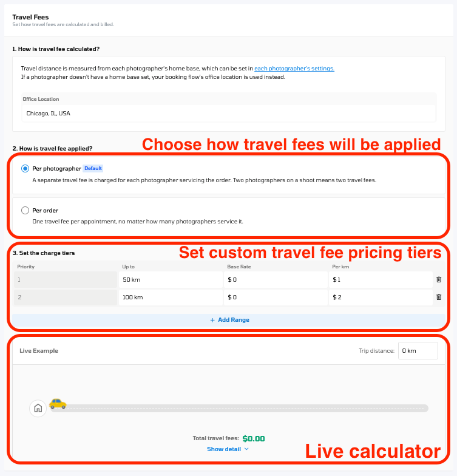

# 2026 Updates

**Titus Integration - Get Paid Now, Let Agents Pay at Close**\
Titus is a payment provider built for real estate. Connecting it gives your clients a new way to pay you, and gives you a way to stop waiting on invoices.

When an agent reaches the payment step, they can either pay right away by card, or choose Pay at Close. If they choose Pay at Close, you are paid straight away and the agent settles up when the property sale closes. You are not financing the gap, and you are not chasing the invoice.

For agents this removes the awkward part of the conversation, because they no longer have to pay for marketing a property before it has earned them anything. For you it means the money arrives when the work is done rather than whenever the agent gets around to it.

Connect your own Titus account and you will see it appear in three places: a promotion on your booking page so clients know the option exists, Pay at Close alongside the usual card option on the delivery page and invoice, and the payment method on the invoice in your admin view so you can see at a glance how each order was paid.

To set this up: Navigate to **\[Org Settings] > \[Features] > \[Third-party connections]**, turn on Titus, and connect your Titus account. You can edit or disconnect it from the same place at any time.

One thing to note: Titus charges a fee on Pay at Close transactions, which takes the place of the usual card processing fee, and a separate fee applies to the agent. Your Titus account covers the exact rates. 

**A Brand New Login and Sign Up Experience**\
Your login page is the first thing your clients see when they arrive at your portal, and it has been completely redesigned.



The new page pairs a large welcome area with a clean sign-in card carrying your logo. Signing in is simpler too: Sign in with Google sits right up front, email and password are entered in two short steps, new accounts confirm their password, and forgot password has been redesigned.

**Make it yours**\
You can now style the page to match your brand. Upload a background image or video, pick a background colour, and write your own headline and message in your choice of fonts. A live preview shows how it will look on a phone and on a laptop before you save.

To set this up: Navigate to **\[Org Settings] > \[Portal Branding] > \[Login/Sign Up Page].**

**Set Up Your Orders Table the Way You Work**\
Your orders table is now much easier to shape around the way you work:

* Drag the edge of any column to make it wider or narrower.
* Choosing which columns appear, and the order they appear in, has been redesigned to be quicker to use.
* Add a column straight from the table.
* The Services column now sizes itself to fit what is in it.



Filtering by customer name is also much faster now. Accounts with a large customer list were slow to filter, and that has been sorted.

To find these: Navigate to **\[Order Management].**

**Fairer Travel Fees and Bookings Improvements**\
On orders with more than one photographer, the travel fee is now worked out from the photographer who travels furthest, rather than whoever happened to be picked first. On orders where two people come from opposite ends of your area, the fee now reflects what the job actually costs you. Single-photographer orders are unchanged.

Your selected services now stay put when booking through the Scheduler, even if you switch to another Scheduler tab to check something.

An address typed in by hand now displays the same way as the same address chosen from the Google suggestions.

\
**Direct Upload, Still Open to Beta Participant**\
Direct Upload is still open by request while we gather feedback, and it picks up three improvements this round.

You can now build marketing flyers using photos you uploaded through Direct Upload, so the Flyer Builder works the same way whichever route your photos came in by.\
The Files section also accepts more than PDFs now. You can attach documents, archives and images alongside your photos and videos.\
You can start creating a listing website straight from the Direct Upload page, without going looking for it elsewhere.

_If you would like Direct Upload switched on for your portal, get in touch and we will set it up for you._

**Jobs Management, Still Open to Beta Participant**\
Jobs Management is also still open by request while we gather feedback, and it picks up two improvements this round.

Assign anyone on your team from a job template\
Job templates now let you choose any team member as the default editor or reviewer, including admins, staff and contractors. Previously, the Editor and Reviewer options on a template only listed people set up as Photo Editors or Video Editors. If a project manager or operations lead reviewed your work, you had to assign them by hand on every job after it was created. Now you set them once on the template, and every job created from it is assigned automatically.

Jobs opens faster on busy accounts\
Jobs no longer waits to load your entire customer list before you can start working, so it opens quickly however many customers you have. The Customer Name filter now shows customers as soon as you open it. Type a name or email address to narrow the list down. If you open a saved or shared link that already has a customer filter applied, the filter shows that customer's name.

_If you would like Jobs Management switched on for your portal, get in touch and we will set it up for you._

**Minor Enhancements & Bug Fixes**

* The Luxury listing website theme now shows its gallery horizontally, which gives photos more room and suits wide images better.
* Listing website content is now centred when a listing has no cover photo, instead of sitting off to one side.
* You can now publish a listing website again from the order details page after it has been unpublished.
* Fixed an issue where invoice PDFs failed to open.
* CubiCasa and Esoft are more dependable. When CubiCasa corrects a floor plan, the new version now replaces the old one instead of being skipped or duplicated. Esoft orders are now marked complete once Esoft delivers them. And an error about the owner email that could stop floor plan orders reaching CubiCasa has been fixed.
* Mobile fixes: the invoice page now scrolls properly in the mobile app, and the Send button on the completion email is no longer cut off when using Chrome on a phone.
* Fixed an issue where booking through the Scheduler cleared your selected services if you switched to another Scheduler tab to check something.

## 9/14/2026

**Order Floor Plans Through CubiCasa**\
CubiCasa turns a phone scan into a polished floor plan. Walk the property once, skip the measuring tape and CAD software, and the finished floor plan comes back to you.

You can now use CubiCasa without leaving Tonomo. Tell us once which of your services are floor plan services, and these services will automatically go to CubiCasa every time a client makes a booking. You can follow its progress from the order, and when the floor plan is ready it appears on the client's delivery page by itself. No emailing files back and forth, and nothing to download and re-upload.



To set this up: Navigate to **\[Org Settings] > \[Features] > \[Third-party connections]**, turn on CubiCasa, connect your CubiCasa account, then choose which of your services to send.

<figure><figcaption></figcaption></figure>

**Send Photos to Esoft for Editing**\
Esoft is a post-production company for real estate media. You send them your photos, they handle the editing, and the finished images come back to you.

<figure><figcaption></figcaption></figure>

You can now work with Esoft directly from Tonomo. Choose which of your services should go to Esoft for editing, and whenever a client books one of them, the Esoft order is prepared for you automatically. Each order has its own Esoft section, so you can now centralize editing progress right in Tonomo without having to log in multiple places, and once the editors are finished, the images automatically come back into Tonomo on their own, ready to deliver.

To set this up: Navigate to \[Org Settings] > \[Features] > \[Third-party connections], turn on Esoft, connect your Esoft account, then choose which of your services to send.

Note: Esoft needs a photographer assigned to the order.

**Direct Upload (Now in Beta)**\
This is the big one. You can now upload your edited photos for delivery directly inside Tonomo, no Dropbox round trip, no third-party storage in the middle. Open the order, drop in your finished files, and send the delivery email from the same place. Your uploads stay saved if you step away mid-job, so you can pick up where you left off.



**Direct Upload Improvements: Dropbox Import, 360 Tours, and More**\
Direct Upload the media workspace that lets you build deliverables directly in Tonomo picks up a substantial round of additions this release.

* **Import from Dropbox** If you have the Dropbox integration enabled and the order has a linked folder with media in it, you'll see a Photo source section when creating deliverables, showing how many files were found. Switch on **Import from Dropbox** and those files are pulled into the workspace and sorted into their sections automatically. Imported files behave exactly like ones you upload by hand, you can rearrange them, delete them, add more alongside them, and deliver them the same way. The import runs one way only: nothing you upload in Tonomo is pushed back to Dropbox.
* **360 Photos and Panorama Support** A new **360 Photos** section accepts 360 photos kept separate from your regular photos. On the delivery page they render in an interactive panorama viewer in their own section, so clients can look around the room instead of at a stretched flat image. Dropbox import works for this section too when the order's folder has a 360 or Panorama subfolder.
* **A Files section** PDFs and other files now have a home of their own, alongside Photos, Videos, 3D, and Floor Plans, with the same upload, edit, download, delete, and bulk-action behavior as the other sections.



_**Availability:** If you would like this feature switched on for your portal, just get in touch and we will set it up for you._ 

\
\
**Keep Track of Your Post Production Work with Jobs Management (Now in Beta)**\
Jobs bring your post production work into Tonomo. Instead of tracking photo editing, video editing, quality checks and revisions in a spreadsheet or a separate project management tool, every piece of work becomes a job that sits with the order it belongs to.



You describe the work your team does once by setting up job templates. From then on, when an order has a confirmed shoot date, the jobs are created for you automatically and their due dates are worked out from the way you set the template up. Nobody has to remember to create the work, and nothing quietly falls off the list.

Every job can have an editor assigned to it, and a reviewer if you want a second pair of eyes before the work goes out. The review step is optional, so if your team does not do a separate review pass you can simply turn it off.

<figure><figcaption></figcaption></figure>

<figure><figcaption></figcaption></figure>

Open any job to see everything about it in one place. From there you can move it to a different status, change the due date, swap the editor or reviewer, and flag it for attention if it is at risk of being late.

To find this: Navigate to **\[Jobs Management] > \[Jobs]** or **\[Jobs Template]**.

_**Availability:** Jobs is switched on for a small group of clients at the moment while we gather feedback on it. If you would like it turned on for your portal, get in touch and we will set you up._

**Improved Customizable Notifications for Brokerage Admins**\
Brokerage admin notifications are no longer all-or-nothing. A new **Notification assignments** table on a brokerage's Notifications tab lets you add each admin as a recipient, choose which agents they receive notifications for — all of them, or a named list — and choose which notification types they get. Every admin can have a different combination.

To set this up, go to Org Settings > User Management > Brokerages > \[Brokerage] > Notifications.

<figure><figcaption></figcaption></figure>

**Individual notification preferences**\
Each user, whether agent, photographer, or customer, now has a **Notification Preferences** tab on their profile with a row per notification type and separate Email and Text Message controls, so people can tune what reaches them without an admin changing settings for everyone.

To find it, go to User Management > Users > \[select user] > Notification Preferences.

<figure><figcaption></figcaption></figure>

 

**Decide Who Can BookYou**\
Marking a booking flow private used to only hide it from your public booking page — anyone with the direct link could still open it and place an order without logging in. That works well if you want agents to self-serve, but not if your pricing is confidential or you run many different configurations per brokerage.&#x20;

Booking flow settings now separate **visibility** from **access**, as two independent controls in a new Visibility & Access section:

* **Show on booking page:** whether the flow is listed on your public booking page.
* **Who can book:** either **Anyone with the link**, or **Brokerage members only (login required)**.

In Tonomo, navigate to **Configure Booking > Booking Flows > Edit > Visibility & Access**.\
Nothing changes for your existing flows: every public flow was migrated to Public with "Anyone with the link," which preserves exactly how it works today, and agents booking through a brokerage-linked flow are still added to that brokerage automatically.

 

**Set a Default Look For Each Brokerage And Agent**\
Listing website templates can now have defaults, set per brokerage and per agent, so new websites start with the right look without anyone picking a template each time.

A new **Property Template** page in the property website admin panel lets you set the brokerage default and the agent default. Admins and brokerage managers can set the brokerage default; admins, staff, and the agent themselves can set the agent default. When a new listing website is created, the agent's default is applied first, falling back to the brokerage default.\
\
Two things worth knowing. **Defaults only affect newly created websites** — they never restyle a site that already exists. And **each property now stores its own template selection**, so changing the template on one listing website never affects another, even when they share a brokerage or a listing agent.

**A Clearer Invoicing Filter System**\
Three changes make the Invoicing table quicker to work in.

* **An Accounting Contact column.** Every invoice now shows the contact it's linked to in Xero or QuickBooks, sitting between Brokerage and Date Created. Click the cell and you get a searchable dropdown — change the linked contact right there in the table instead of opening the invoice. It works the same way for batched invoices. Customer and Brokerage are also now two separate columns rather than one combined field.
* **Filter by booking flow.** The invoice page can now be filtered by the booking flow an order came through — useful when different flows map to different pricing or different parts of your business.
* **Multi-select order status filtering.** Order status filtering now accepts more than one status at a time, so you can look at several states together instead of filtering repeatedly.

In Tonomo, navigate to Accounting > Invoicing.

**Minor Enhancements & Bug Fixes**

* The order header now hides as you scroll, giving you more room on the page.
* Fixed an issue that prevented videos from uploading in Native Upload.
* Fixed an issue that prevented some customers from opening a preview link.
* Fixed an issue where scheduling hours were not applied correctly to certain services.
* Fixed an issue where the scheduled time variable displayed incorrectly in email templates.
* Resolved an issue where the first name variable did not populate in the Pay To Unlock Reminder Email.
* Corrected inconsistent payment status labels on the order dashboard.
* Fixed an issue where travel time was calculated incorrectly when placing an order from the Scheduler.

## 8/26/2026

**Listing Website Themes**\
Picking a theme for a listing website is now simpler and more intuitive. The property theme page has been updated, renamed to **Design**, and the theme dropdown is easier to use when you're choosing the look for a new listing.

<figure><figcaption></figcaption></figure>

**Filter Orders by Booking Flow**\
The new Orders Management page has a new filter. You can now narrow your orders by the booking flow they came through, which helps if you run more than one booking flow and want to look at them separately.

**Minor Enhancements & Bug Fixes**

* Fixed an issue where creating an order from the Scheduler could freeze until you reloaded the page.
* Fixed an issue where the Download button for full-size images sent people to Dropbox instead of downloading the file, on both iPhone and Android.
* Fixed an issue where special characters appeared as code in template titles and subject lines.
* Fixed an issue where the confirm button in the marketing flyer editor was missing or didn't fit on screen. 

## 8/7/2026

**Three New Listing Website Templates: Vera, Lumen, and Haven**\
Three brand new single property website templates are now available, Vera, Lumen, and Haven. Each one is built for a full desktop layout and a dedicated mobile view so you can pick the look that best fits your clients listings. We've also renamed the existing templates to match the new naming: **Legacy is now Atlas**, **Basic is now Casa**, and **Box is now Juno**. Nothing about how those templates work has changed only the names. Any listing websites you've already published keep their current design.

<figure><figcaption>
Vera
</figcaption></figure>

<figure><figcaption>
Lumen
</figcaption></figure>

<figure><figcaption>
Haven
</figcaption></figure>

**New Forced Selection for Recommended Time Slots**\
Recommended time slots can now be made mandatory. Turn on **Force selection of recommended time slots** in your booking flow settings, and customers booking on a date that already has recommended slots will only see those slots. On dates with no recommended slots, every available time still shows as normal so you're never blocking a booking. This turns recommended slots from a suggestion into an actual scheduling tool. It's most valuable on your busiest days where a single badly placed booking can cost an hour of driving. 

**Travel Fees, Rebuilt**\
Travel fees have been rebuilt, and they now connect properly to what your photographers are paid, you can find these settings in:\

\
Configure Booking > Edit Booking Flow > Settings > Travel Fees\

\
The settings are now three simple steps instead of one long page. As you make changes, a calculator shows the fee right away and breaks it down line by line, so you can check Travel Fees before you save. 



**Minor Enhancements & Bug Fixes**

* If you're still on the old Orders Management page, you'll now see a banner with a short walkthrough introducing the new one and what's changed.
* The new Orders Management page has some layout changes based on your feedback.
* Portal branding settings now look more consistent.
* The Marketing Kit's Confirm property details screen now shows in your portal's language.
* Amenity suggestions no longer show in English when your portal is set to another language.
* Fixed an issue where custom questions for one service showed up on orders even when that service wasn't added.
* Fixed an issue where travel time distances didn't always come out the same.
* Fixed an issue where rescheduling a package with a twilight service showed all daytime openings instead of twilight ones.
* Fixed an issue with viewing the photographer workflow checklist.
* Fixed an issue where the search box on the Orders Management page didn't clear when you refreshed.
* Fixed an issue where changing a property's address in the listing website admin panel made the map disappear.
* Fixed an issue where turning on a listing website over a slow connection gave an error.
* Fixed an issue where currency displayed as CA,NZ, NZ ,NZ, or A$ instead of just $.&#x20;
* Fixed an issue where the agency logo was too big in the footer of the Casa website template, which used to be called Basic.
* Fixed an issue where preview links didn't show the cover photo and address the way delivery links do.
* Fixed an issue affecting Dropbox sync notes.

## 7/20/2026

**Connect Tonomo to Claude.**  \
Tonomo now connects to Claude and other AI assistants that support MCP, so you can ask questions about your orders, invoices, and account  instead of digging through screens. This is just the beginning and the capabilities are basic, but we have plans to invest in making this integration smarter, more flexible, and more powerful. You can join the [#mcp](https://tonomocommunity.slack.com/archives/C0BJLFK85QC) channel to provide your feedback!



**Customizable Notifications per Brokerage**\
You can now control who receives which notifications for every booking made under a brokerage. A new Notification Settings tab in each brokerage's settings lets you route notifications to the agent, to an admin, or to both, so each brokerage only gets the alerts that make sense for how it operates.

You choose from three presets:

* Agent Only — notifications go to the agent listed on the booking.
* Admin from {brokerage} — all notifications go to a selected admin in that brokerage.
* Customized — set notification preferences separately for the agent and for a selected admin.



**Minor Enhancements & Bug Fixes**

* Fixed an issue where the unsync icon in the File Links column remained after deliverables were resynced.
* Resolved an issue that caused errors when syncing floor plan photo files to the delivery page.
* Fixed an issue where the File Links column showed a "folder failed to create" error when RAW folders were not enabled.
* Fixed an issue where the unbranded listing website link was incorrect on the Orders Management page.
* Fixed an issue where the custom tier price did not display the initial amount when booking through the Scheduler.
* Resolved an issue where batch invoices could fail across parent and child brokerages.
* Made a round of Order Management refinements based on feedback, including order statuses, the delivery email modal, date filters, filter behavior, and sort order.

## 6/18/2026

**Dropbox Improvements**

*   **Auto-Sync Is Here**\
    Tonomo can automatically detect changes in your connected Dropbox folders and sync those files onto the delivery page automatically. To enable this feature navigate to Configure Booking>General and scroll down to the dropbox section and enable "Auto Sync Delivery files from Dropbox.

    <figure><figcaption></figcaption></figure>

*   **Customize the way your RAW files are organized**

    You can now choose how your RAW files are organized in Dropbox: by order or by photographer. This gives admins control over the folder structure that best fits their team's workflow.  To customize go to Configure Booking>General and scroll down to the dropbox section and select organized by order or by photographer.

    *   Organized by photographer (Traditional)

        <figure><figcaption></figcaption></figure>
    *   Organized by order

        <figure><figcaption></figcaption></figure>

**Child Brokerage now clearly visible in Invoicing**\
Invoicing now shows the child brokerage in the Brokerage column, and you can filter by child brokerage as well. For teams that manage parent and child brokerage relationships, this makes it much easier to find and group the right invoices.  In the Accounting>Invoicing section if an agent belongs to a child brokerage it will not be displayed in the brokerage column like Parent Brokerage/Child Brokerage as shown:

<figure><figcaption></figcaption></figure>

**A Refreshed Order Management Design**\
The New Order Management page has received an updated design for a cleaner and more consistent look. Where we fixed several column display issues and fixed an issue where the Monthly View tab did not respect the reset date filter. The delivery page Link column now also includes a "deliver" button that will allow you to send the agent the project complete email, just keep in mind clicking on deliver will not change the order status to completed. 

<figure><figcaption></figcaption></figure>

**Other Minor Enhancements & Bug Fixes**

* Cash payments can now be applied to batch invoices, giving you more flexibility in how you settle grouped charges.
* Custom domains on listings can now be removed cleanly whenever you need to update or retire one.
* The `{{private_notes}}` email variable now renders as clean plain text, so your templates display exactly as intended.
* Video playback now starts at full resolution right away for a sharper viewing experience from the first frame.
* Appointment-rescheduled notifications are now more precise, firing only for the relevant change rather than unrelated calendar updates.
* Refined the text alignment in the left-side navigation panel for a cleaner, more polished layout.

## 6/4/2026

**Order Management Improvements**

Order Management continues to improve this sprint:

*   **New Compact and Expanded views** — The Orders Management page now offers two new ways to view your orders: a Compact view for scanning more orders at a glance, and an Expanded view for seeing more detail per order. To change between views click on the gear icoin in the top right corner and select between compact and expanded: 

    <figure><figcaption></figcaption></figure>

<figure><figcaption>
Order Management Expanded View
</figcaption></figure>

<figure><figcaption>
Order Management Compact View
</figcaption></figure>

* **Smoother scrolling** — Tab scrolling has been improved, and table headers now scroll horizontally together with the table content. Previously, the header could stay fixed while the columns below moved.
* **Brokerage column accuracy** — Fixed an issue where the Brokerage field was not populating in its column on the new Orders Management page.

**Minor Enhancements & Bug Fixes**

* Fixed an issue where referral discounts were not displayed in Order Details.
* Fixed an issue where headshots appeared blurry on listing websites.
* Fixed an issue where 360 image thumbnails displayed the top of the image instead of the center.
* Fixed a display issue with the color picker in Portal Branding settings.
* Fixed an issue where the two-photographer feature did not work for orders containing both a package and a separate service.
* Fixed an issue where bulk-changing order statuses to In Progress did not create the corresponding Dropbox folders.

**Coming Soon: Titus Integration has now moved into development stage**\
Big news on the horizon our Titus integration has officially moved into development! This is one of the most requested integrations yet, and we can't wait to bring it to your workflow.

## 5/21/2026

**Automatic RAW File Cleanup on Dropbox**\
Tonomo can now automatically delete RAW files from your connected Dropbox after a configurable retention period. This helps you manage storage costs without having to manually clean up large RAW files once they're no longer needed.\
In Tonomo, navigate to Configure Booking > General > Dropbox. You'll find a new retention period setting that controls how long RAW files are kept before they're automatically removed. Set the timeframe that works for your workflow, and Tonomo handles the rest.

<figure><figcaption></figcaption></figure>

\
**Order Management Improvements**\
Order Management received a significant round of improvements in this release, making it easier to find, filter, and manage your orders.

* **Multi-select payment status filtering** — You can now filter your order list by multiple payment statuses at once. For example, view all orders that are "Partially Paid" or "Unpaid" in a single view, rather than toggling between individual filters.
* **Future date support in filters** — Date filters now allow you to select future dates, making it easier to view upcoming scheduled orders and plan ahead.
* **Orders show correct times** — Filters now reliably keep your selected time when switching between views or applying additional filters. Previously, the time portion of a date filter could reset unexpectedly.
* **Contractor access controls** — The "Limit Contractor Access" setting is now fully respected in Order Management. Previously, contractors could see orders and specific order details they shouldn't have had access to.
* **Search and filter reliability** — Fixed an issue where the search bar and filters on the Order Management page were not returning the expected results.
* **Order status accuracy** — Resolved an issue where order statuses could get out of sync, causing incorrect status labels to display on orders.



**Minor Enhancements & Bug Fixes**

* Fixed an issue where service and package availability was not loading correctly, preventing customers from seeing available time slots.
* Fixed an issue where a referral code applied on the booking page incorrectly marked the order as fully paid when it was only partially paid.
* Fixed an issue where last names with two words could not be entered in the contact section of listing websites.

## 5/7/2026

**New Order Management Design** \
The order management redesign is live! Finding orders and customizing your view is easier than ever, with a completely revamped filtering system and a handful of new features. Check out this quick walkthrough to get started.



\
**Portal Branding: Expanded Font Selection**\
Your portal branding now includes a larger selection of system fonts. Choose from an expanded list of font families to better match your brand's typography across your customer-facing portal.\
In Tonomo, navigate to Settings > Portal Branding and select from the updated font list. Combined with the text color, header color, and button color options from previous releases, you now have full control over your portal's visual identity.

<figure><figcaption></figcaption></figure>

**Recurring Invoice Email Toggle**\
You can now control whether recurring invoice emails are sent to agents. A new toggle lets you enable or disable these automated emails, giving you more flexibility over your billing communications. In Tonomo, navigate to Configure Booking > General to find the new Recurring Invoice Email toggle.

<figure><figcaption></figcaption></figure>

**Minor Enhancements & Bug Fixes**

* Improved date and sorting filters in Order Management for a smoother workflow when searching and organizing orders.
* Fixed an issue where Dropbox links were not being created for deliverables.
* Fixed an issue where Google Maps was not loading correctly during address entry.
* Fixed an issue where duplicate calendar events were created for a single order.
* Fixed an issue where single video delivery pages and share links were not loading correctly.
* Orders in Order Management now default to newest-first sorting for a more intuitive view.

## 4/22/2026

**Order Management Tags (Only available on new order management beta design)**\
You can now create, assign, and manage custom tags directly within Order Management. Tags let you label and categorize orders however works best for your team, whether by priority, project type, client segment, or anything else you need to track.

In Tonomo, navigate to Order Management and select any order. You'll find a new Tags field where you can add existing tags or create new ones on the fly. Tags are searchable and filterable, so you can quickly pull up all orders with a specific label.\
_Note: This feature is currently available on the new Order Management beta design. If you’d like it enabled on your portal, we’re still looking for a few more testers who are willing to provide feedback.  Just reach out to support and we will be happy yo enable it for you._

<figure><figcaption></figcaption></figure>

**Portal Branding: Fonts and Text Color**\
Portal branding has been improved. In addition to the header and button colors introduced in the previous release, you can now customize your portal's font style and text color to match your brand identity.

In Tonomo, navigate to Settings > Portal Branding. You'll see new options for selecting a font style and setting your preferred text color. These changes apply across your customer-facing portal, giving you full control over the look and feel of your branded experience.

<figure><figcaption></figcaption></figure>

**Billing Reminder Emails for Weekly/Monthly Agents**\
Flexible Agent Billing now includes automatic reminder emails. For agents set to Weekly or Monthly billing terms, Tonomo will send billing reminder emails 7 days after the first invoice has been sent to keep agents informed about outstanding invoices.

To configure this, go to the Agent profile and ensure the billing terms are set to Weekly or Monthly. Reminder emails are sent automatically, no additional setup is required. 

<figure><figcaption></figcaption></figure>

**Minor Enhancements & Bug Fixes**

* Fixed an issue where the address lacked a detailed breakdown when an order was placed through the branded booking flow.
* Fixed an issue where the bulk action bar did not appear when selecting orders in the Monthly calendar view.
* Fixed an issue where not all data from an order row was visible to the user in Order Management.
* Fixed an issue where the order list did not display correctly when certain filters were applied.
* Fixed an issue where downloaded web-resolution photo folder names included random characters instead of a clean file name.
* Fixed an issue where add-on services already included in a package still appeared in the add-on selection during booking.
* Fixed an issue where the add-on priority list showed all add-ons instead of only those configured for the booking flow.
* Fixed an issue where editing an address in Order details did not save correctly when the organization country was set to the Netherlands.

## 4/8/2026

**Automated Billing for Weekly and Monthly Agents**\
Tonomo now automatically batches completed orders into invoices based on each agent’s billing terms found in their profile. For agents set to Weekly billing, the system collects all orders marked Completed from Monday through Sunday and creates a draft invoice the following Monday. For Monthly billing, completed orders within a calendar month are batched into a draft on the 1st of the following month. Agents on the default Pay Per Order setting are unaffected.\
\
When a batch invoice is created, Tonomo automatically sends the agent an email notification with a link to review the full breakdown and pay.  The email template is editable and you can find it in Configure Booking > General named "Recurring Invoice Email."\
\
To set an agent’s billing terms, navigate to the Agent profile and select the desired Payment Type. If an agent belongs to a brokerage, individual agent billing settings will override brokerage-level defaults.

<figure><figcaption></figcaption></figure>

**Holiday Schedule**\
You can now configure company-wide holidays directly in Tonomo. Holidays are applied across scheduling and availability, so your team and clients see accurate time slots without manual adjustments. To manage holidays, navigate to Configure Booking > Holiday Schedule.  Once in the holiday scheduling tool simply select the holidays for your team, scroll down to the bottom and click "Set Holidays"

<figure><figcaption></figcaption></figure>

**Portal Branding: Custom Colors**\
A new Portal Branding section is now available under Org Settings > General. You can customize the accent color used for buttons and the header color across all customer-facing pages, including booking pages, invoices, the delivery page, order dashboard, and sign-in screens. A real-time preview panel shows your changes before you save.\
To configure, go to Org Settings > General > Portal Branding, choose your colors, and click “Update the settings.” Font and font color options are coming soon.

<figure><figcaption></figcaption></figure>

**Enhancements & Fixes**

* Resolved multiple issues with travel fee calculations: travel fees are no longer incorrectly added when adding a service via Order Management to an order that should not have one, calculations for specific address edge cases have been corrected, and edited travel fees now remain properly categorized in Reporting instead of appearing as custom line items.
* Fixed an issue where the photographer variable did not populate in the follow-up email template.
* Fixed an issue with reordering photos on the delivery page.
* Resolved an issue with Apple calendar event formatting.
* Fixed an issue where the confirmation email subject used a manually edited event title instead of the default format.
* Booking time slots are no longer shown for days that have been disabled for a specific booking flow.
* Fixed an issue where the invoice did not update correctly when changing the property square footage from Order Management.

## 3/25/2026

**Batch invoicing by customer (agent-level batching)**\
Batch invoicing now supports grouping by individual customer (agent), in addition to the existing brokerage-level batching. Admins can now batch invoices for agents who have no brokerage, or choose to bill an agent directly even when a brokerage exists. \
In Tonomo, navigate to the Invoicing section and filter by customer. Select the invoices you'd like to include, click Batch, and the system will group them together whether or not the agent belongs to a brokerage.

<figure><figcaption></figcaption></figure>

**Enhancements and minor fixes**&#x20;

* Team discounts applied to a brokerage now automatically carry over to all of its child brokerages. Previously, discounts set at the parent brokerage level had no effect on child brokerages.
* Resolved an issue causing availability to load slower than expected.
* Resolved an issue preventing negative payments from being applied to a batched invoice.
*   Resolved an issue where the save button in the template editor appeared grayed out and could not be clicked.

     

## 3/16/2026

**Auto-Unlock Orders for Weekly / Monthly Agents**\
We introduced new **Agent billing terms** that allow admins to set how agents are billed and automatically control when deliverables become available to clients. \
\
A new **Payment Type** field is available in the **Agent profile**. Admins can select one of the following options:

* **Paid Per Order at Delivery** (default) - Files unlock according to the rules configured in your booking flow settings. If **“Lock files until order is paid”** is enabled, agents with this option selected will not have access to the files until the order has been fully paid.
* **Weekly -** When an order reaches **Completed** status deliverables automatically unlock even if payment has not been received.
* **Monthly -** When an order reaches **Completed** status deliverables automatically unlock even if payment has not been received.

<figure><figcaption></figcaption></figure>

**Coming Soon**\
**Automatically send payment emails for Weekly/Monthly Agents** - Tonomo will automatically batch and send payment reminders to your customer based on their payment terms.

**Minor Enhancements & Bug Fixes**

* Removed booking page error message for admins when no payment processor (Stripe/Square) is connected.
* Fixed an issue where selecting the correct address from Google returned a different address.
* Fixed an issue where a customer’s saved card did not appear when admins booked orders on behalf of clients.
* Resolved an issue where the **first name** variable did not populate in the _New Agent Welcome Email_.
* Fixed a template issue where manually created orders did not apply the correct calendar event subject format.
* Fixed an issue where default custom tiers were not applied when adding a package to an order.

## 2/25/2026

**Automatic Brokerage Discounts**\
Admins can now set an automatic coupon for a brokerage that applies to all orders without agents needing to enter a code. When any brokerage member creates an order, the selected coupon applies automatically. If the coupon is invalid, disabled, or expired the system handle that appropriately.\
To enable this feature, first create a coupon. Then, navigate to User Management > Brokerages, select the target brokerage, and go to the Pricing tab. In the Team Discounts section, assign the desired coupon from the dropdown." 

<figure><figcaption></figcaption></figure>

**Customizable Two-Photographer Shoot Duration**\
Administrators can now customize the duration adjustment factor when assigning two photographers to an order. Previously, when two photographers were assigned, the system automatically reduced the total time to 70% (0.7x) of the original shoot duration. This value was fixed and could not be changed. To configure this setting, navigate to Configure Booking > Scheduling. Use the slider for 'Duration reduction for 2 photographers' to set your desired multiplier, then click Save Changes. All future orders with two photographers assigned will automatically use this new duration. 

<figure><figcaption></figcaption></figure>

**Minor Fixes & Improvements**

* **Fixed:** Due date and time now save correctly in the new Order Details interface.
* **Fixed:** "Hide service prices in packages" setting now properly hides prices on downloaded invoice files (previously only hid them on the web view).
* **Fixed:** File previews on mobile devices no longer displaying as a white screen and now display correctly.

## 2/6/2026

**Xero improvement: Customer Xero Invoice Link**\
For all our Xero users, If your portal is connected to Xero and an invoice has already been synced, the system will take you directly to that invoice in Xero. If not, you'll see the standard Tonomo invoice with payment options. To ensure shared invoice links always work, we've added a safety feature: if someone opens a shared Tonomo link for an invoice that was _later_ synced to Xero, they'll see a prompt letting them choose to stay on Tonomo or view it in Xero.

<figure><figcaption></figcaption></figure>

## 1/13/2026

**Improved adding services to an existing order**\
We’ve streamlined the process of adding services to existing orders, making it faster and clearer to schedule appointments from within order management. When adding a service or package to an existing order, you can now choose whether it requires an appointment.  **To add a service to an existing order**, simply navigate to the order and click **"+ Add Services"**. From there, the process follows a familiar path: select the desired service, then choose whether to attach it to an existing order appointment or schedule it as a new one by selecting **"+ Add New Appointment"**, which will take you directly to the calendar scheduler for placement. 

<figure><figcaption></figcaption></figure>

**QuickBooks Fixes and Improvements**

* **Tax Calculation Fix:** Resolved an issue where QBO invoices were incorrectly applying sales tax to the platform’s transaction percentage fee. Transaction fees are now properly marked as non-taxable, ensuring invoice totals and tax amounts match Tonomo records precisely.
* **Enhanced Invoice Descriptions:** QBO invoice line items now automatically include detailed descriptions such as service date, property address, and assigned team member providing clients with clearer, more professional invoices.
* **Quickbooks Batch Invoicing:** Introduced the ability to submit multiple Tonomo invoices to QuickBooks Online as a single batch.
