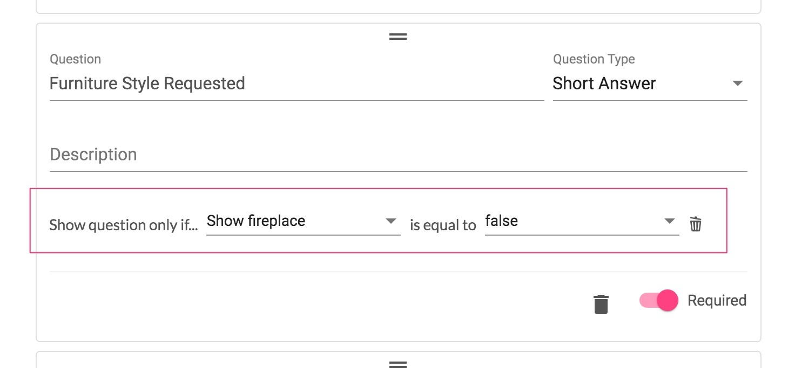

# 2021 Updates

## 12/3/2021

**New Features**

* **Booking Flexibility!** For time slots only (not for block scheduling), a user is now asked a required question “is scheduling flexible.” This does not impact scheduling, it's just so your team knows if they can adjust their schedule on the fly. [https://gyazo.com/905f1a206d9ab8fe7179474b263828db](https://gyazo.com/905f1a206d9ab8fe7179474b263828db)
* **Ask for Beds/Baths in booking!** There is now an option in booking flow to require bed/bath details. If you create a single property website, we’ll also automatically pass that info in.

**Enhancements**

* Order Details panel now use collapsible panels. [https://gyazo.com/d983daf463f4ba447158c33f7d33b38b](https://gyazo.com/d983daf463f4ba447158c33f7d33b38b)

## 12/1/2021

**New Features**

*   **New Delivery Experience!** You can now offer multiple links for different elements of your deliverables to your clients. In addition, there is a new interface for their deliverables.

    [https://www.loom.com/share/0bc51ef1300d4a3cb9a5e08b8808dd12](https://www.loom.com/share/0bc51ef1300d4a3cb9a5e08b8808dd12)

**Enhancements**

* Deliverables will no longer be locked by payment status. Moving an order to Complete will now send the Project Complete email and the deliverables will be unlocked.

## 11/24/2021

**Enhancements**

* Coupon Codes can now have [usage limitations](https://gyazo.com/aa60f04a627dae1d8ab5c5ec13a6c4fb). You can set a coupon to be used only a certain number of times, or only once per new customer, and set an expiration date.

## 11/16/2021

**Enhancements**

* You can now search by coupon and agent code fields
* When you attempt to delete a Service or Package, we will as you to confirm if you want to delete it

## 11/08/2021

**New Features**

* **Slack Notifications!** You may now receive a Slack notification every time you are mentioned in a project chat. It will look like this:

.png>)

**Note:** You won't get notifications for messages you send yourself. So if you want to test it, have someone else send them.

You can get a quick guide to setting this up here: [https://www.loom.com/share/b9ea6675690b4a7f9f9f5d31238a0d03](https://www.loom.com/share/b9ea6675690b4a7f9f9f5d31238a0d03)

**Enhancements**

*   **Customizable Columns!** Under Order Management, you can now customize the columns that appear for each order. These settings are per-user so your team members with different use cases can tailor the portal to their needs.

    This is accessible in the top right of the table for orders after you've expanded one of the rows like "Pending".

## 10/09/2021

**New Features**

*   **Single Property Websites!** We now support building single-listing websites within Tonomo. We support all the media types your customers will need, photos, video, 3D Matterport, floorplans, and documents.

    We're excited for you to start offering these to your agents and get feedback from you on how we can make Single Property Websites even better.

    Please see this video for a quick 4 minute walkthrough of the new feature.: [https://www.loom.com/share/184560ba318b4600a2b6f140a8906b9c](https://www.loom.com/share/184560ba318b4600a2b6f140a8906b9c)

## 09/21/2021

**New Features**

* **Email Notifications!** You may now receive email notifications every time you receive a message you are tagged in a project chat. It will look like this:

.png>)

Each User will need to set this themselves under their account in the top right corner.

.png>)

**Enhancements**

* **Upload PDFs to Project Chats**. You can now upload PDFs to Project Chats much like you can in Slack or other instant messaging services. For a gif of how this works, see [https://gyazo.com/dd5a8f7b0b0db779847f48960208f70c](https://gyazo.com/dd5a8f7b0b0db779847f48960208f70c)

## 09/16/2021

**New Features**

* **Integrated Payments**
  * **Accept payment before delivery WITHOUT a deposit!** If you set the deposit to $0 or 0% OR bypass it when booking as an Admin, we will now still generate an invoice they must pay before delivery.
  * Deposits are now configurable _per booking flow_  and have been moved from **General** settings to **Booking Flow** settings

**Enhancements**

* **Order Complete Emails.** Now when you set an order to complete, you will get a spinning circle. This is us sending and confirming the send of the Project Complete email. You cannot click out of this screen as it loads. You will get a confirmation of success or failure at the bottom when it's done.
* **Booking Confirmation Emails.** Under Order Details, you can scroll to the bottom and click the **Resend booking confirmation** button to resend that email.

* **Booking Flow Enhancements**
  * There are now two new options on all of your booking flows. These allow you to make Branding information optional. We will still require Contact information, but if this option is disabled, Agents will not need to enter photos, logos, and other branding information
  * You may remove the License # from customer Branding entirely if that is not required in your area.

.png>)

* **Custom Packages** now sorts by price in the booking flow with the most expensive first.
* If no photographers are available, we will now prompt Agents to reach out to your contact email for potential booking availability.

## 08/26/2021

**New Features**

* **Multiple Booking Flows!** You can now create multiple booking flows to customize how a market or maybe a partnership hires your services. For more information, see our article on Multiple Booking Flows [here](https://docs.getautonomo.com/services-and-packages/booking-flows).
* **Report a Bug!** When something goes wrong in the portal or you're seeing something that isn't quite right, we now have a little pink bug icon in the bottom right corner of the portal. Click that and get us some information on the issue you experienced. This will tie in to some of our backend reporting and get us a ton of information about what went wrong.\
  \
  Please use this before reaching out to us in Slack so we get more information to fix it more quickly!

## 07/5/2021

**New Features**

* **Pay-Before-Delivery!** On orders that have paid a deposit, you can now charge your customers for the remainder before they can take delivery of their assets. We will subtract the amount of the deposit from the invoice. If your customer adds a service after they pay the deposit, we'll add the full value of that service to the second payment before they can get their assets.

Here is the experience your customers will have:\
[https://www.loom.com/share/7e169f94d4d44268b24560c267fb9ca3](https://www.loom.com/share/7e169f94d4d44268b24560c267fb9ca3)

* **Data Studio Reporting!** We now have your individual Google Data Studio warehouses set up. As we discussed, this is version 1 of these reports. You have full edit control over them like you would in any Google Drive document. We recommend making a copy of what we send you so that you can freely play with it.
  * We expect over time to roll out new reports to everyone. This is going to be a collaborative experience as we create and share reports. Please keep the lines of communication open. What can we improve?

**Improvements**

* When a photographer **doesn't** have a Service Zone, the system will now default to them having no geographical restrictions. This means you can set a Service Zone for one of your photographers and leave the rest on default. That one photographer will have geographical restrictions, but all the others will not.

## 06/21/2021

**New Features**

* **Accepting Payments!** By connecting your Tonomo account to Square, you are able to accept payments and deposits from your customers at the time of booking. Please contact us if you would like this turned on as Square needs a little configuration on our end per customer. 
* **Coupons!** You may now offer discounts to your customers on either a percentage or flat dollar amount basis. Under **Configure Booking** > **Coupons** you may create a coupon that either discounts the total bill by, for example, 10% or by $100
  * Your Agents will enter their code above the Select Services page of the booking process. We also display the Description field of the Coupon Code that you can enter when creating one. This is optional, but feel free to add on a message for each coupon.

You may add Coupons to orders created under the **Sales** section of the Order Details tab.


Coupons will only work with new orders that were created after this update. Do not use with orders created before this update.


**Improvements**

* During booking, the time zone the Agent sees is now based on the address of the property they are booking for.
* In Order Management, instead of creating a new service for an Escalation, you can convert an existing service into an Escalation. This allows you to move the Escalation through the Order Management pipeline (Pre-Production, Production, Post-Production, etc.)
* In Jobs, you may now conditionally show and hide intake form questions based on previous answers to checkbox question. For example, if in your Job intake form you ask "Virtual Staging?" and a checkbox for the answer, you can create a second question that asks "What style of Furniture" IF the checkbox for "Virtual Staging?" is checked.

* If you are taking deposits, you can disable those deposits from the URL by adding the string " [?integratedPayments=false](https://portal.aerialcanvas.com/book?integratedPayments=false)" to the booking URL.
  * For example: `portal.company.com/book?integratedPayments=false`
  * If you are also using Agent codes: `portal.company.com/book?integratedPayments=false&agent_code=CODE`

**Bug Fixes**

* Some reports wouldn't allow you to download them from the Download Excel button. This has been fixed.

## 05/26/2021

#### New Features

*   **Webhooks!** Webhooks are a simple form of integration that allows you to **send** (not receive) information to other apps. For example, you could send all details about every order to a service like [Zapier](https://zapier.com/) which would send your order to one of a selection of 3,000+ other apps, like your book keeping or CRM solution.

    Enter the Webhook URL under **Configure Booking** > **General**. To find more information about Webhooks, see [this guide](https://zapier.com/page/webhooks/) from Zapier. While tons of services support Webhooks, they operate fairly similarly, so if you've never worked with them before, this is a good primer.

    Please note, that Webhooks only allow you to **send** information to another app. The app you send information to cannot send information **back** to Tonomo. So you could send an order to QuickBooks, but if you mark an invoice as paid in QuickBooks, it would not notify Tonomo that the invoice was paid.

#### Improved Features

* **Additional Communication Templates.** You may now customize your templates for Reminder Emails and Project Complete Emails. These are found along with the other existing templates under **Configure Booking** > **General**.
* **Book an order as a guest.** No more using Incognito to book an order for a customer! When booking, just click **Book order as** at the top and then **New Customer**.
* **Photographers are now automatically added to orders.** When booking with Integrated Booking turned on, when the system assigns an order to a photographer, the photographer is now also assigned to the order in Order Management.
* **Schedule now has a Day view** instead of just a Week view. Under **Schedule**, click the **Day** tab and then select the calendars that you&#x20;

* **Easily invite additional emails to Orders in Scheduler**. Now when you open an order in **Scheduler** and go to **Event Details**, you will be able to add additional emails to the order so that they receive future emails.
  * Enter the email address in the **Email** box on the right and hit enter. They will appear under the Guest list. Click **Update Calendar Event** and the invite will be sent out!
  * To remove them, click the X to the right of their email and they will receive a cancellation notification and the event will be removed from their calendar.

## 05/13/2021

#### New Features

* **Communication Templates.** You may now edit your order confirmation email and event description templates within the Tonomo portal! This allows you to tailor these templates to your brand and then when an order confirmation email or event description goes out, the system will tailor it to every unique order.\
  \
  We have a complete guide on how to edit your templates and use our variables [here](https://docs.getautonomo.com/templates/intro-to-templating).\
  \
  We have other editable templates in the pipeline like emails for "appointment reminder", "project completed", and "create a new account".\
  \
  Take a look at our guide and if you have any questions, please let us know.

## 05/05/2021

#### New Features

* **Service Areas!** You may now define what geographical areas each photographer operates in. This means when an agent books a service, we'll route orders only to those photographers who service the project address.

[Watch video for more info\
\
](https://www.loom.com/share/c49a87f9058044019403ed3a2c52c4ad)

* **Create an event from your calendar in Tonomo.** Create orders by simply clicking and dragging on the **Schedule** tab in Tonomo (much like you can create calendar events in Google).

[Watch video for more info](https://www.loom.com/share/ab443d1c70f945218368daac00d32ac5)[\
\
](https://www.loom.com/share/ab443d1c70f945218368daac00d32ac5)

#### Improved Features

#### Scheduler

* The Scheduling button now takes you to a view where you can see all events for the week
  * The Scheduling _configurator_ has been moved to **Configure Booking** > **Scheduling**
* **Prevent Last Minute Bookings** is a new option under **Configure Booking** > **Scheduling.** You enter in the number of hours notice you need to accept an order.&#x20;

#### User Management

* You may now edit the Agent branding information under **User Management**. This will impact all future orders
* Under **User Management** as well is a new **View Orders** button which will show you all of the orders for a specific Agent

#### Fixes

* Archiving orders should now also cancel calendar events
* Projects that are created and later converted to Video will now appear when filtering by Video
* We now better validate phone numbers and emails during booking to prevent errors/bugs

