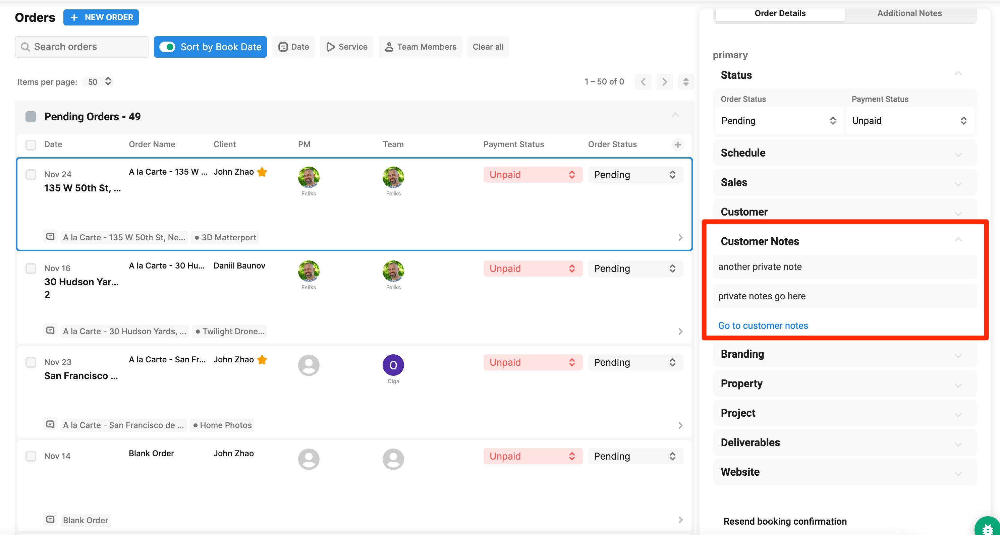

# 2022 Updates

## **12/28/2022**

**New Features**

**Drive Times**

We now calculate the actual drive times (as given by Google Maps) between the location of the shoot and the photographer's next one.\
\
So for example, if a photographer is done with a shoot at 1:00pm and the customer is 45 minutes away from that shoot, they won't be able to book with that photographer until 1:45.

To turn this on, just go to **Configure Booking** > **General** and toggle on **Calculate drive times during booking.**

<figure><figcaption></figcaption></figure>

**SMS Notifications**

You can now send SMS messages in addition to (or instead of) email Booking Confirmation, Reminder, and Complete messages. These SMS message templates work identically to our email templates and can be edited.

<figure><figcaption></figcaption></figure>

**Enhancements**

**Multiple Reminder Emails**

You can now set multiple reminder emails on different schedules. For example, you could send an email the day before the shoot reminding them of the details and then another email the morning of the shoot with a pre-shoot checklist.

Just go to **Configure Booking** > **General**, scroll down to **Emails** and click edit to the right of **Reminder.** Then click **+ Add Template** in the top right corner.

<figure><figcaption></figcaption></figure>

**% Based Discounts and Fees**

We now support fees and discounts based on a % of the running total of the order.



## **12/8/2022**

**New Features**

**Scheduler (Beta)**

We’ve released a new scheduler which will replace the old one. This is currently in beta status but is available for use. The scheduler helps you better organize your photographer's time, create orders, and manage events.



**Agent Orders Dashboard Overhaul**

We’ve redesigned the agents order dashboard to be cleaner and more modern. It’s now easier for agents to view many orders at the same time.



**Filter Services/Packages based on the Size of the Shoot**

If you want to hide some services from particularly large or small shoots, you can now opt to remove Services/Packages from your Booking Flow for particular Sq Ft Tiers. You can find this in the settings of each Service/Package.

<figure><figcaption></figcaption></figure>

**Enhancements**

**ACH Payment Method**

Customers can now pay via ACH Direct Deposit

**New Webhooks**

We’ve added new webhooks for calendar events. These can be used to trigger external automations or changes to CRMs when calendar events are created, updated, or changed.

<figure><figcaption></figcaption></figure>

## **11/15/2022**

**Enhancements**

**Save Credit Cards**

Your customers can now save credit cards to their account



**Private Notes Per Customer**

<figure><figcaption></figcaption></figure>

## 11/7/2022

**Enhancements**

Clients can now preview assets BEFORE paying (if you have "lock files until paid" turned on)



## 11/3/2022

**Enhancements**

You can now export users. We include some guidance on how to merge and cleanup users before exporting.



**Merge/Cleanup Users**



## 10/29/2022

**New Features**

**Listing Agent Enhancements**

As an admin, you can now autocomplete and fill any user as a listing agent. For your customers, they will be able to automatically find any agents in their brokerage to add to an order as a listing agent.



## 10/26/2022

**New Features**

**Invoicing**

You can now create, edit, and send Invoices directly within Tonomo.



## 08/29/2022

**Passwordless Login and Phone Authentication**

Your customers will now be able to log in with their phone numbers. All they have to do is enter their phone number and we will send them a one time password.

This also eliminates duplicate accounts as all accounts will be uniquely authenticated

<figure><figcaption></figcaption></figure>

**Listing Websites Update**

You can now set cover videos for listing websites!



## 08/22/2022

**Delivery Experience Refresh**



**Enhancements**

* admin can reorder images on delivery page
* improved the layout of images to use the images true aspect ratio
* increased image preview sizes
* increased the resolution (less blurriness) for cover photos
* simplified the download buttons and moved them directly onto the delivery page
* skip delivery folder creation for specific services - inside service configuration, you can now set services to not create a dropbox folder for that service

## 07/22/2022

**New Features**

* You can now set CC/BCC for email templates
  * .jpg>)

**Enhancements**

* You can now edit the project complete email PER ORDER before sending
* "Book Order As" anonymous users
* Directly upload logos to text editors on the booking form ([https://gyazo.com/4a9ab6d7465f56c501fc31055e03ac36](https://gyazo.com/4a9ab6d7465f56c501fc31055e03ac36)) 

## 06/07/2022

**New Features**

* [User Management Overhaul](https://docs.getautonomo.com/portal-setup/user-management)
  * UI Overhaul
  * Change Profile Picture
  * Dedicated Staff Members per Agent (auto-assign Project Managers when an Agent orders)
  * Private Notes
  * Send Password Reset Link
* Booking Flow Improvements
  * [Add-Ons Priority](https://docs.getautonomo.com/services-and-packages/booking-flows#add-ons-priority) (Change which order Add-Ons appear in)
  * [Add Logos to the top of Booking Flows](https://docs.getautonomo.com/services-and-packages/booking-flows#landing-page-options)

**Enhancements**

* Coupons can now bypass deposits, regardless of the deposit amount.

## 4/28/2022

**New Features**

* New Legal disclaimers in Single Property Websites

.png>)

* [Contractor Payout Reporting](https://docs.getautonomo.com/order-management/contractor-payout-reporting)
* Customize the color of the background per booking flow
* Customize which columns appear in the Order Management panel
  * Time of Shoot
  * Customer order link
  * Deliverables link
  * Property Website link

.png>)

**Enhancements**

* Removed "/Full Size (Large)" from the gallery names of SPW website

## 4/5/2022

**New Features**

**Schedule Project Complete Emails**

* You may now schedule project completion emails to customers!
  * Full walkthrough [**here**](https://www.loom.com/share/0b197fc1a1da494db71f5ebba47ebfe1)

.png>)

**Enhancements**

* Travel fees are now based on driving distance, not straight-line distance
* Agent codes are no longer caps-lock sensitive

**Single Property Websites**

* You can now disable and re-order the sections for your website under **Settings** > **Theme**.  &#x20;
* We now hide fields when they are empty (i.e. price, bedrooms, baths, etc.)
* Baths and half-baths are now on Single Property Websites
* Website link is now on the order status page (previously was only on Order Dashboard page)
* Fixed an issue where sometimes videos didn't appear
* Several typo/mislabels fixed
* Removed zip code and country from address
* Removed background line
* Address in background no longer scrolls

**Bug Fixes**

* You can now enter zip codes into Single Property Websites starting with "0"
* Fixed an issue that caused orders in Pending to sometimes get stuck in a loop, freeze, or jump around when scrolling
* Squashed a few bugs that caused Delivery Sync to get stuck

## 3/15/2022

**New Features**

* **Reschedule/Cancel Links for your Customers!**
  * Your customers can now reschedule or cancel the order themselves via links you can embed into calendar appointments or emails
  * More information on setup here: [https://docs.getautonomo.com/scheduling/change-calendar-details-after-booking](https://docs.getautonomo.com/scheduling/change-calendar-details-after-booking)

**Enhancements**

* When you add a new service and chose for it to update the calendar, it will also increase/decrease the duration of the event based on the services and packages in the order.
* The scheduling page will now show an estimated duration for each order.
* You can now recreate calendar events inside the scheduler! If an order was previously cancelled or for some reason is missing a calendar event, you can still open the event up inside Tonomo and create a new calendar event for that order.

## 2/15/2022

**New Features**

* **Travel Fees (and home bases)**
  * You can now charge your customers a flat rate + per mile fee depending on the distance of your home location of every photographer.
  * If your photographers have different home bases, we will display the different travel fees for your photographers. In this example, one photographer is quite close to the shoot and so between 9am and 1pm there is no travel fee. Starting at 2pm, another photographer is available and has a different home base, and so there is a travel fee.

.png>)

* See this video for how to set it up: [https://www.loom.com/share/5fee2636b3264e848491fc020e35520d](https://www.loom.com/share/5fee2636b3264e848491fc020e35520d)
  * Just to give you the math again for a 76 mile trip, based on the example in that video:
    * tier 1 fees: $0\
      tier 2 fees: $35 ($10 base + $1\*25 mile)\
      tier 3 fees: $17 ($15 base + $2 \*1 mile)\
      Total: $52
* **Sales Tax**
  * You can now charge Sales Tax on all invoices per Booking Flow. Just go to your Booking Flow settings and you'll see a new option for Sales Tax.

.png>)

## 2/8/2022

**Enhancements**

* **Duplicate Services, Packages, and Custom Packages!**
  * You can now duplicate your offerings, helping you create variations more quickly and avoid human error

.png>)

**Dropbox videos will automatically embed into the delivery page**

* You no longer need to host your videos on Youtube/Vimeo to get them to appear on the delivery page.
* Just upload the whole file and we will play it as a video on the delivery page.
* Limitations:
  * If you have a Youtube or Vimeo link in the folder AND files, we will preview the Youtube/Vimeo link.
    * If you want to preview the files while having a Youtube/Vimeo link, click Edit Links in the portal and delete the Youtube/Vimeo link. We will then preview the files instead.
  * We support .mp4, .mov, .webm, and .3gp file types

**Control whether we ask for custom domain or their music choice**

* While these toggles are in the UI now, they do not change your booking flow. We've added them early so that you can toggle them to what you need.&#x20;
* **We have already set these toggles to what you already use per booking flow.**
  * **If you do not want** to change whether you ask these questions or not, no action is needed.
  * **If you want** to change, toggle them before next week!

.png>)

## 2/2/2022

**New Features**

* **Availability settings per photographer**
  * This allows you to have more control over what times of day/week each of your photographers are available for shoots.
  * We will still check for availability per their appointments in Google, so these controls are **in addition to** what we already do
  * Check out a quick walkthrough for more information



**Enhancement**

* **Select and move multiple orders to a status**
  * This allows you to bulk move orders to In Progress or Complete as your team processes orders

## 1/12/2022

**New Features**

* **We create Dropbox folders for you!** You can now have Tonomo create Dropbox folders for you for every order. Before this feature will work for you, see our video on setup:
  * [https://www.loom.com/share/51a387561f0d42d9bc06a5a87dd9b552](https://www.loom.com/share/51a387561f0d42d9bc06a5a87dd9b552)
  * The biggest benefits to this are:
    * Standardizing and automating your folder structure so that everyone knows where all the assets go every time.
    * Speeding up our processing so that you don't have to wait as long for syncing to occur.
    * You don't have to export assets in multiple formats, just do full-size and we resize to MLS
  * The size of the MLS assets are 2048x1536 with some compression.

**Enhancements**

* You can now easily drag and drop the items in a checklist into a different ranking.
* We improved the order management accordions experience. When expanded, the accordions won't take up as much space if there are only 1 or 2 orders in that section.
* You can now drag and drop orders between order statuses (in addition to changing the dropdown toggle as before).

**Bug Fixes**

* We've reconfigured our scheduling integration with Nylas which should improve reliability booking. We have also added additional logging that can help us find any remaining issues.
* We fixed a case where photos would get stuck optimizing in Single Property Websites. We've also added a check so that if this happens again, we won't display a broken link
* Lot sizes on Single Property Websites now supports decimals
