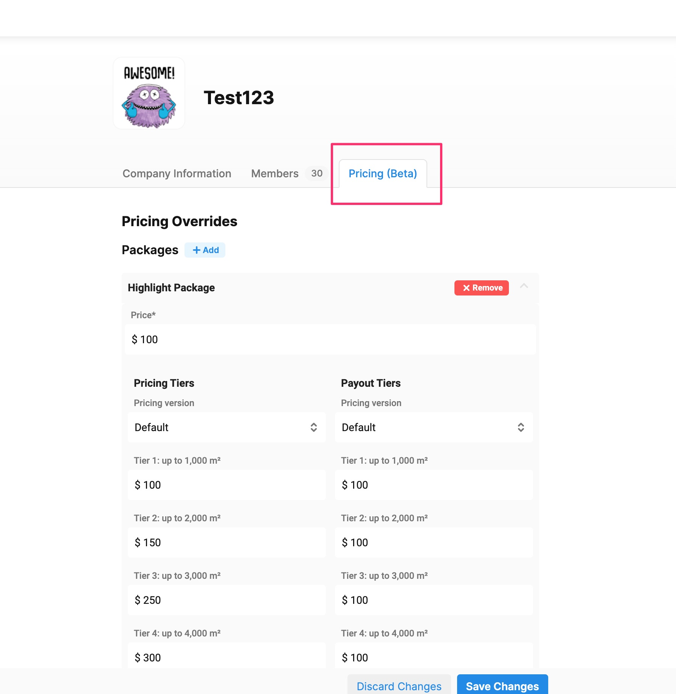
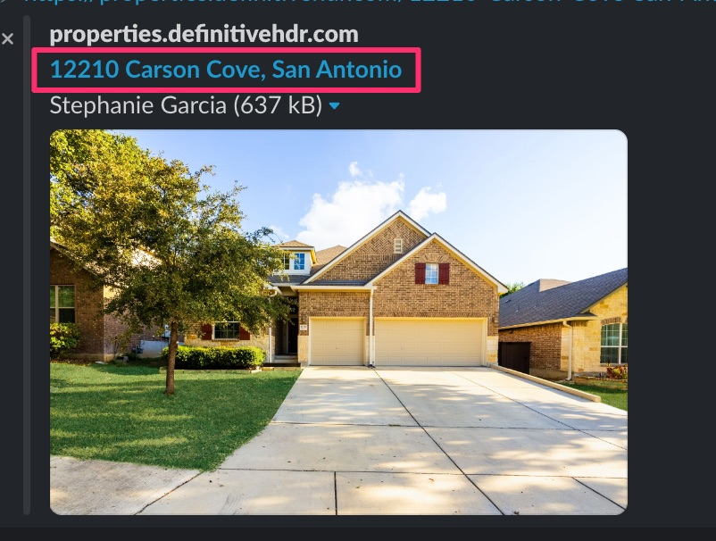
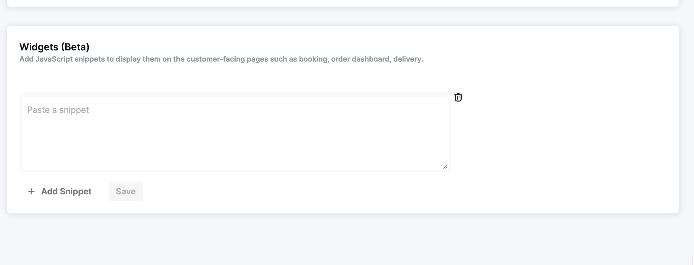
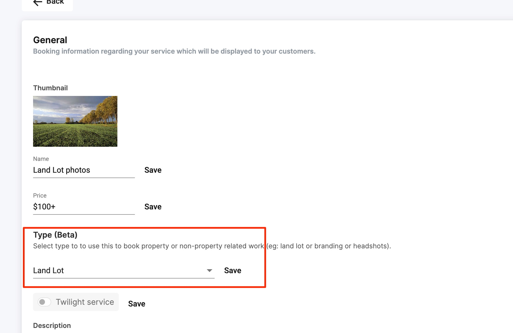
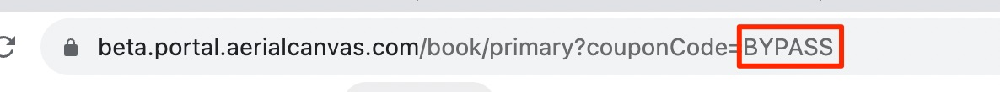
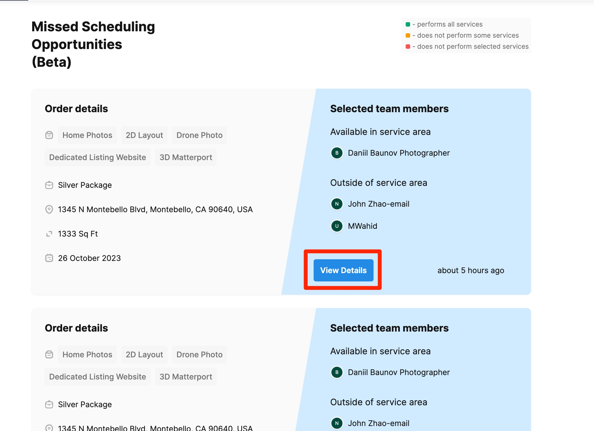
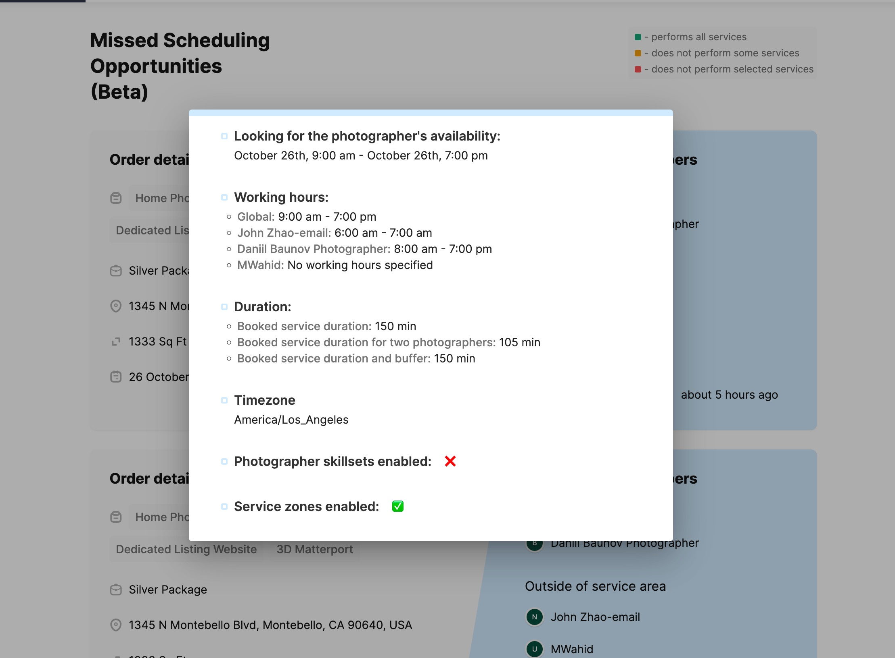
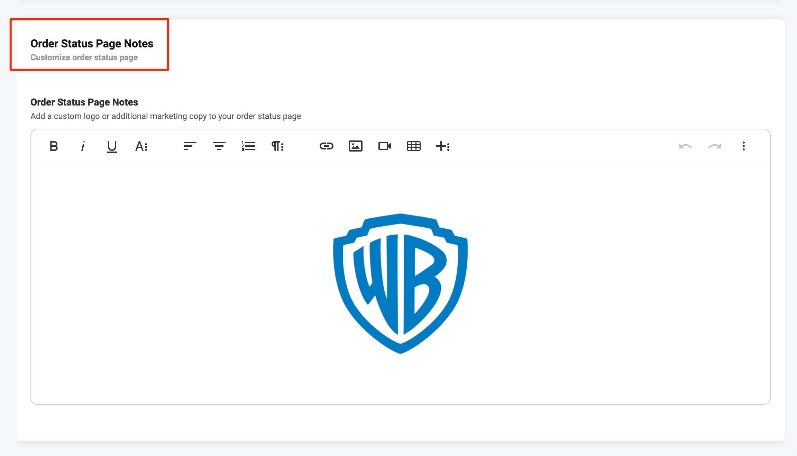

# 2023 Updates

## 12/7/2023

Traffic Reports for listing websites - every listing website will now include a traffic report for your agents!

<figure><figcaption></figcaption></figure>

## 11/28/2023

**Recommended time slots** -  We’ve released a major improvement to make the automated scheduling smarter: When your customers request an appointment, Tonomo will recommend timeslots with photographers that already have nearby appointments. This helps to reduce the amount of time your photographers travel between photoshoots. Using recommended time slots will also waive travel fees for locations that would normally have them.Please take a look at this video to learn more about this feature



## 11/16/2023

**Save website themes to customer's profile** - You can now save any customizations for listing websites to a customer's profile. These changes will automatically apply to future websites created for that customer.

<figure><figcaption></figcaption></figure>

**Custom Pricing for Brokerages** - This feature enables you to set unique prices for select services or packages for a brokerage. It's a convenient alternative to creating an entirely new booking flow. Use it to modify the prices of specific services as needed for a particular brokerage. You can set the custom pricing from the Pricing tab on the brokerage page.

<figure><figcaption></figcaption></figure>

**New Marketing Templates -** New templates are available for Instagram stories, facebook posts, and post card formats. You can find these in the flyer builder tool.

<figure><figcaption></figcaption></figure>

**Minor improvements**&#x20;

* Listing websites will now show the property address as the the title of the page instead of the listing agent when shared on social media.

<figure><figcaption></figcaption></figure>

* Invoicing reporting - you can search for invoice number in orders reporting

## 10/18/2023

**Add javascript plugins to your portal** - You can now add snippets of javascript to customer facing pages! You can use this to add live chat, marketing and page analytics plugins to your portal.

<figure><figcaption></figcaption></figure>

**Photographer schedule** - We've added a convenient schedule page that your photographers can use to see their upcoming orders.

<figure><figcaption></figcaption></figure>

<figure><figcaption></figcaption></figure>

## 10/3/2023

**Referral program**\
\- Referred customer will receive the credits on their first order instead of after their first order\
\
**Delivery page improvements:**\
\- QR Codes are automatically generated for listing websites

.png>)

**(fixed) Scheduler:**\
\- Orders added through the backend scheduler will include travel fees

Changes to **Contractor permission, users set as the contractor permission level:**\
**-** Can now only view orders they are assigned to in order management\
\- Can't access any reporting pages\
\- Option inside of **Booking Config > General** to hide all invoicing and sales information in the portal from contractors

**Flyer builder:** 8 more templates added 

<figure><figcaption></figcaption></figure>

## 9/28/2023

**Support for Land lot services**



How to setup:

1\) Configure Acreage tiers in **Booking Config > General**

2\) Create land lot services and change service **Type** to **Land Lot** and fill out pricing tiers

<figure><figcaption></figcaption></figure>

3\) Create booking flow and enable **Show Acre input** in **booking flow options**

\
Better support for Land lot services\
Option to enable Acreage question to booking page 

## 9/26/2023

**Booking improvements -** \
\
**New Booking flow options**:\
\- Option to enable/disable Apartment/Floor and Sq Ft question from booking page\
\
**Automatically add coupons through links** - You can copy the link from the coupons page. The link can also be appended to the booking page url like&#x20;

<figure><figcaption></figcaption></figure>

**Custom packages** improvements now support setting default custom tiers

<figure><figcaption></figcaption></figure>

**Improved Missed scheduling opportunities reporting** to add more details about each booking\
\
**Scheduling page improvements** - You can now rename the title of reserved time slots 

## 9/5/2023

\
**Interactive Floor plans for Listing Websites**



**Workflow improvements**

* You can now automatically move booked orders directly to **In Progress**. This is a great option of your company does not use a "Pending" step. Recommended for smaller businesses without project managers.

<figure><figcaption></figcaption></figure>

* Removed the caching behavior for booking flows. Previously, you had to specifically navigate to the booking page and refresh to load updates.&#x20;

## 8/25/2023

:tada: **Listing websites now have free SSL support for all custom and white labeled domains!**

**Usability improvements to listing websites:**

* resyncing photos from dropbox won't reset any changes to galleries that the customer made
* listing websites will now just have 1 gallery instead of sub galleries based on the services on the order
* **design update**: the default theme now has a full-width cover image



\
**Delivery improvements:**

* Agents can now select and download multiple images from the delivery page, instead of one at a time



* "Promised payment" payment status will unlock files from delivery page
* You can now hide preview of deliverables for a booking flow

**Other improvements to scheduling and workflows:**

* You can now disable specific days for booking (don't let customers book on saturday or sunday)

<figure><figcaption></figcaption></figure>

* You can now filter orders in order management by booking flow (there are still some limitations around how many filters you can use)

<figure><figcaption></figcaption></figure>

* You can now create photographer checklists for **packages and custom packages**
* More information added to each missed scheduling opportunity on the scheduling opportunities page. This page will help identify why photographers could not be scheduled for a requested booking

<figure><figcaption></figcaption></figure>

 

<figure><figcaption></figcaption></figure>

## &#x38;**/2/2023**

**Book branding and non-property related shoots (beta)** - You can now use Tonomo to book non real estate related photoshoots. This will remove the first step asking customers to enter in a property address.  



**Add dropdown custom questions to your booking forms** -&#x20;

<figure><figcaption></figcaption></figure>

\
**Easily manage service areas and assign them to multiple photographers** -



**Delivery page improvements** - Photos on delivery page download based on the order they are displayed in the gallery\
 

## &#x37;**/9/2023**

**Scheduling improvements -** You can now set the max travel time allowed for photographers between shoots within each **Booking Flow**. If the requested appointment requires too much travel time, photographer will be set as unavailable. 

<figure><figcaption></figcaption></figure>

**Scheduling improvements - Streamlined the process of adding listing agents -** Previously when booking for a new customer, you had to enter their information as a customer and also as a listing agent. We've simplified this flow now so if the listing agent is the same as the customer, we'll automatically copy that information over.\
 

<figure><figcaption></figcaption></figure>

**SMS Improvements - Project complete texts are now scheduled along with project complete emails -** If you use the "Send later" feature for project complete emails, we will make sure to send the texts based on the schedule of the project complete emails.

<figure><figcaption></figcaption></figure>

**Add Privates notes to calendar events -** If you have Tonomo setup to send separate calendar events to photographers, you can now include the privates notes on each customer in these calendar events!\
\
**Minor improvements and bug fixes:**\
\- "Pay now" button is no longer shown for cancelled orders on customer's order dashboard\
\- You can now set custom messages in the referral code banner on customer's order dashboard\
\- Customers are now prevented from downloading images from the listing website if the order is unpaid and delivery is locked\
\- improved the "Pay and download files"  button on the delivery page 

<figure><figcaption></figcaption></figure>

##

## &#x36;**/26/2023**

**Update packages and services -**

You can now change and remove packages and services on an existing order form the add services dialog



## &#x36;**/15/2023**

**Priority based scheduling -**

You can now configure Tonomo to use priority based scheduling instead of round robin. Tonomo will assign events to the highest priority photographer unless they are unavailable at the scheduled time. 

<figure><figcaption></figcaption></figure>

 

**Improvements to billing and invoicing -**

We've redesigned the invoice templates to now include:

* Company's address in upper left hand corner
* A separate field for "Billed to" which can be different than the customer's name. This field can be set individually within a customer's user profile.

<figure><figcaption></figcaption></figure>

* Each invoice will also now have an invoice number
* There is a new tab under settings which allows you to add some more customizations for invoices

<figure><figcaption></figcaption></figure>

**Stripe integration now supports the following features:**

* Paying by credit

**quality of life improvements:**

* you can now edit the phone number on a user's profile

**bug fixes:**

* improved general stability of dropbox integration
* you can now post emojis directly from gmail and slack into Chats within project management

## &#x35;**/25/2023**

**Mobile scheduling improvements - you can now create orders through the scheduler on mobile**

\
**Customize the customer's order status page:**\
You can now add a custom message inside booking flow form settings.

<figure><figcaption></figcaption></figure>

These notes will appear on the customer's order status page:

<figure><figcaption></figcaption></figure>

Photographer's information are also shown on the customer's order status page now 

<figure><figcaption></figcaption></figure>

**Booking improvements:**

*   Option to allow customers to select photographers 

    <figure><figcaption></figcaption></figure>
* Admin can bypass service area restrictions during booking

<figure><figcaption></figcaption></figure>

**Misc:**

* “Promised Payment” payment status will also unlock deliverables

**Listing website improvements:**

* You can now download photos in bulk from listing websites
* Downloads will respect the order of the photo gallery

<figure><figcaption></figcaption></figure>

**Stripe integration now supports the following features:**

* Save user payment methods
* Accept customer tips

## &#x35;**/10/2023**

**Delivery page improvements:**\
You can now customize the resolution MLS images are delivered at! You can change this within the General Booking Management page -

<figure><figcaption></figcaption></figure>

## &#x34;**/10/2023**

**Quality of life improvements**\
\
**Order management:**

*   improved the layout of the side panel to make sections easier to read 

    <figure><figcaption></figcaption></figure>
* You will now receive a notification through email when an order is canceled
*   All appointments are now displayed on side panel

    <figure><figcaption></figcaption></figure>

**Reporting:**

*   You can now have a shortcut to see a breakdown of tips by order per contractor\
     

    <figure><figcaption></figcaption></figure>

## **3/24/2023**

**New Feature**

**Referral program** - ready for early release:&#x20;



\
**Scheduling Improvements**

* Improved the calendar updating workflow: Making changes to an order that affect the calendar event will now prompt for updates&#x20;



* Updating address will now automatically recalculate travel fees 

**General usability improvements**

* You can now add a brokerage logo to a brokerage. This will be used as the default team logo for each user within that brokerage&#x20;



**Flyer builder improvements**



**Mobile improvements**

* Made it easier to use the navigation menu on mobile and tablet devices
* Fixed an issue with saving invoice on mobile

**Transaction fees** - you can now set a transaction fee for a booking flow -&#x20;



**Invoicing improvements** -&#x20;

* You can now set a different logo that will be used on your invoices

<figure><figcaption></figcaption></figure>

## **3/16/2023**

**New Feature**

**Save a customer's payment information to charge later**

Your customers can now opt to have Tonomo save the payment information on file so that you can charge it for them at a later date.

* Note, this is a good way to set up a subscription for a customer. Just set a reminder to charge the customer's card!



**Enhancements**

**Booking Improvements** - You can now hide Add Ons based on Services selected. You can select default tiers for Services and Packages. When you select a default tier, the price for that tier will be included in the Package.



**Payment Improvements**

* Contractor payout reporting is now only available to Admins
* Customers can now pay for a portion of an order instead of the entire amount

<figure><figcaption></figcaption></figure>

**Scheduling Improvements**

* You can now create reserved calendar event time slots in the new scheduler



* You can now edit package names on scheduling page

<figure><figcaption></figcaption></figure>

* You can now add an extra buffer time to travel times in scheduling options (**Configure Booking** > **General**)

<figure><figcaption></figcaption></figure>

**Project Management Improvements**

* Private customer notes are now clickable and fully formattable:



* Order management column settings are now saved to a user’s account:



**2/7/2023**

**New Feature**

We now supporting Tipping! Your customers can show their appreciation to you and your photographers by adding a little additional after an order. We'll show a box they can enter a custom amount, but you can also offer them pre-selected amounts in $ or % of order.

<figure><figcaption></figcaption></figure>

Settings for this can be found under **Configure Booking** > **General** and may only be used if you are processing payments thru Square in Tonomo.

<figure><figcaption></figcaption></figure>

## **1/26/2023**

**Enhancements**

**Option to Invite Listing Agents to Calendar Events**

Currently, by default, only the contact person(s) on an order have been getting calendar invites. Now you can toggle a setting so that all persons listed as Listing Agents will also get the calendar invite.

This can be found under **Configure Booking** > **General** and under the **Emails** section

<figure><figcaption></figcaption></figure>

**Bulk Update Payment Status**

You can now update the Payment Status of many orders at once by selecting your orders then clicking the payment status dropdown.

<figure><figcaption></figcaption></figure>

**New Pay and Download Assets Button**

If you're using our integrated payments feature and requiring customers to pay before download, we now prompt them to pay from the delivery page to pay first and then download.

<figure><figcaption></figcaption></figure>

**New Email/SMS Variables for Website Domains**

You can now add the Website URLs of our Single Property Websites directly to Emails and SMS messages. Reach out to us if you want to add this, but you can see that variable [here](https://docs.getautonomo.com/agent-communication/variables#single-property-websites).

**Custom Tier Options now Show in Order Status Page**

We now display the Custom Tier Option selected during booking on the Booked Services summary of the Order Status Page

<figure><figcaption></figcaption></figure>

**Prevent Staff/Contractors from Purchasing SPW Domains**

If you do not want Staff or Contractors to purchase custom domains ($15) for Single Property Websites, you can toggle on this setting under **Org Settings** > **Other.**

<figure><figcaption></figcaption></figure>

**Manually record payments made not through Square/Tonomo**

If a customer has paid thorugh physical check, cash, or other means not through Tonomo, you can record their payment manually on each under under **Payment Details > Make Payment**.

<figure><figcaption></figcaption></figure>

<figure><figcaption></figcaption></figure>

## **1/18/2023**

**New Features**

**Bulk Import Users**

You can now bulk import Users anytime. Whether you're just going live and want to upload your customer list or you just signed up a brokerage and want to get their agents in the portal, this will simplify your customer experience by pre-loading all their info before they book.



You'll need this CSV and check out the 2-minute video as there are a couple of details to catch.


