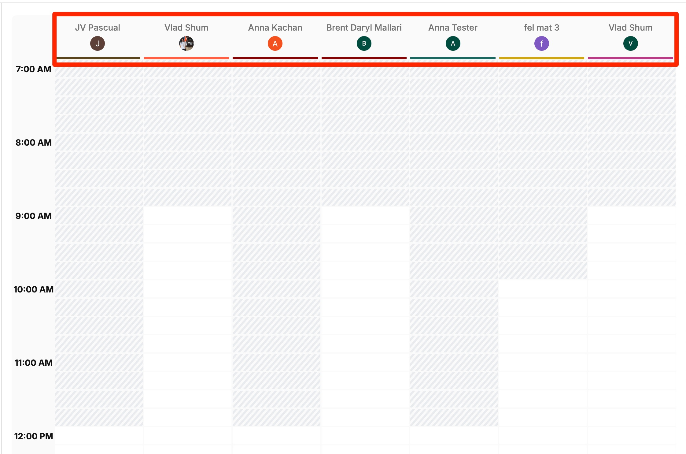
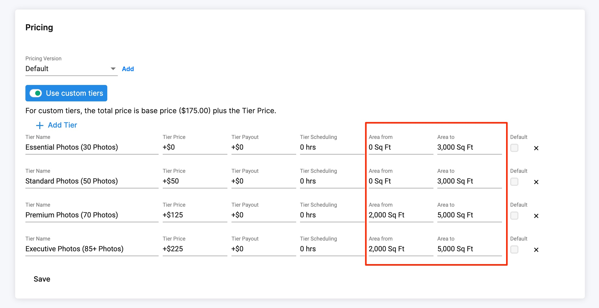
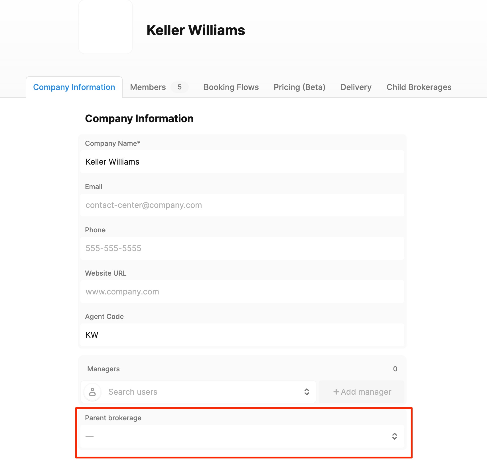
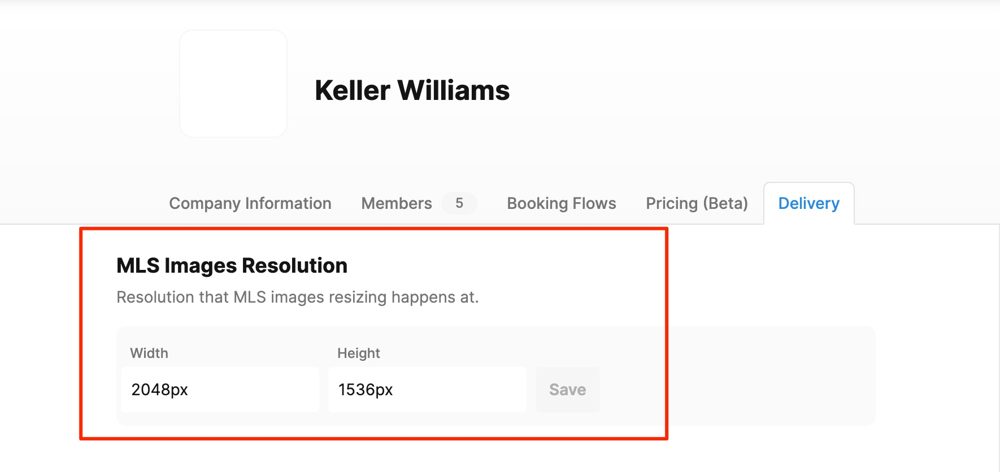
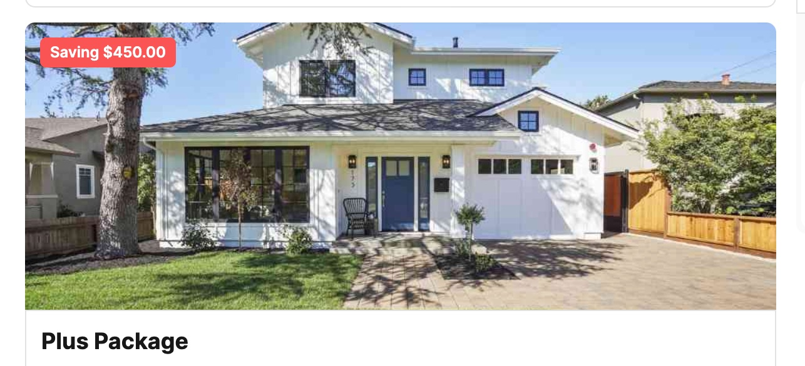
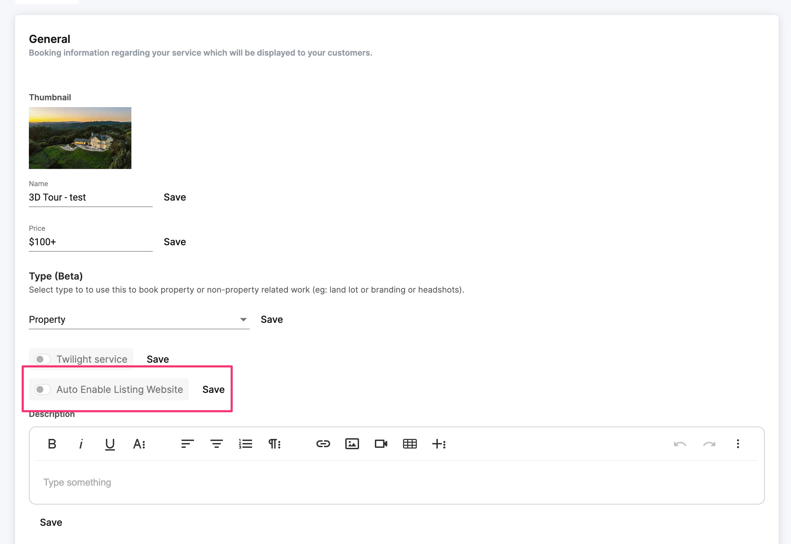

# 2024 Updates

## 12/13/2024

**Follow up email sequence:** To improve customer follow-up and feedback collection, we implemented a feature that allows scheduling a follow-up email to be sent after the Project Complete email.  To enable this feature simply go to configure booking>general and scroll down to the email templates.  Here you will find a send follow up email template you can edit.

<figure><figcaption></figcaption></figure>

Once you edit you will see an option to specify the time delay for sending the follow-up email after the Project Complete email.   

<figure><figcaption></figcaption></figure>

**Cancelled orders will now remove dropbox folders:**  Previously on Tonomo cancelling an order would not delete the dropbox folders associated to that order.  With our latest update now when you cancel an order this will also delete the raw and deliverables folders associated to that order.  For orders that are restores the system will allow you to manually recreate the dropbox folders by clicking "Create folders structure"

**Additional notes field for customer event:**  You can now add notes to both the customer’s and the photographer’s calendar events when using our separate calendar events feature.

<figure><figcaption></figcaption></figure>

**Configure photographers order for scheduling calendar:** You can now configure the order the photographers will appear in the calendar scheduler manually.  Simply go to configure booking scheduling and access the photographers order tab, then configure the order you would like to see the photographers in and this should reflect in the scheduler. 

<figure><figcaption></figcaption></figure>

<figure><figcaption></figcaption></figure>

**Enhancements** 

* Calendar loading time: We have greatly improved calendar load times.  Before there were instances where the calendar would take anywhere from 10 - 20 seconds, this has now been fixed.

## 10/31/2024

*   **Add Brokerage Preferences field at brokerage level -** The Brokerage settings will now display a "Brokerage Preference" field&#x20;

    <figure><figcaption></figcaption></figure>

    This info will be displayed on the "Project" section on the right hand side panel as well as the customer order link.  Here is an example of the Brokerage Notes in the order management section:

    <figure><figcaption></figcaption></figure>

*   **Ability to include in correspondence at a brokerage level for completion email -** You can now add multiple email addresses to the BCC field that has been incorporated at a brokerage level.  This will make it so that when the order is marked as complete and the user sees the send project complete email prompt, the BCC section should be prepopulated with the corresponding emails.

    <figure><figcaption></figcaption></figure>

* **Add preview watermarks to images before they are unlocked** - With Tonomo's latest update there is now a toggle within the booking flow payment settings that allows you to add a watermark text to images until the order has been fully paid.

<figure><figcaption></figcaption></figure>

After the order has been paid the watermark will be removed.  If an order is partially paid the watermark will still be visible and the user may remove the watermark by deleting the text in configure booking>Booking flow.

* **Xero Integration:** Invoices will now have detailed line items describing the service, service details, order details, and customer details in preparation for the batch invoicing feature

## 10/25/2024

*   **Hide Separate Calendar Event for Customer -** In Tonomo you have the opportunity to enable a separate calendar event for your customer in configure booking>general. The purpose of this was to have the photographer and the customer on separate calendar events.  Previously if this toggle was enabled both the customer and the photographer events would be shown on your primary calendar and this would cause confusion as it would create two events of the same shoot on the primary calendar.  We have fixed this so the customer event is now on a separate calendar and can be easily hidden.

    <figure><figcaption></figcaption></figure>
*   **Add street address on maps throughout platform** - With our most recent update street addresses will now be viewable when selecting your address.  This will make locating the right address much easier for clients who need to input their address manually or need to move the pin to a specific location. &#x20;

    <figure><figcaption></figcaption></figure>

*   **Show all the appointments for orders on email templates** - Beforehand, Tonomo just used one "variable" for scheduled time and date for the email templates:\
    .png>) \
    The issue was that some orders had more than one appointment and clients need to show both appointments on the confirmation email, so we made it possible to show all the appointments for each order by changing the template to the following:&#x20;

    <figure><figcaption></figcaption></figure>

**Xero Improvements**

*   **Add "Invoice synced" system message to the Project chat** - We have implemented a message displayed in the project chat whenever an invoice is synced to Xero. 

    <figure><figcaption></figcaption></figure>

* **Update Tonomo order payment status once xero invoice has been paid** -  The order status in Tonomo will now update automatically when and invoice has been paid in Xero. 
*   **Filter invoices by brokerage and order schedule date -** Invoices can now be filtered by brokerage and by customer separately:&#x20;

    <figure><figcaption></figcaption></figure>
* **Prevent Sync of Tonomo Agent Emails to Xero Contacts during setup and sync -** Now whenever you sync or resync an invoice as approved or draft, the emails in Xero Contact will never be changed.
*   **Add a visual way to indicate that the invoice is out of sync** -  There is now a visual indicator in Tonomo that will inform you that an invoice in xero is out of sync with Tonomo.&#x20;

    <figure><figcaption></figcaption></figure>

    Also when an invoice is updated within Tonomo you will be prompted to resync to Xero&#x20;

    <figure><figcaption></figcaption></figure>

*   **Set "Unsynced" tab as the default view on the Invoices dashboard -** The invoice dashboard in "Accounting" will now show "Unsynced" as the default view:&#x20;

    <figure><figcaption></figcaption></figure>

**Minor Improvements**

*   **Remove blue image on marketing kit when no logo/image/headshot is uploaded** - Previously any marketing kit that had been generated with an agent who had no logo, image or headshot would show a blue square with empty space.  This has been modified to not show the blue square anymore making the marketing kit much presentable when users profiles are not complete.

    <figure><figcaption></figcaption></figure>

* **Ability to remove 'NZ' on NZD currency and just display '$' -** For clients in New Zealand pricing will now only be displayed with a "$" symbol instead of "NZ"
* **Scheduling issue on specific dates -** There was a minor issue where the selected date would change once confirming the scheduling section and advancing to the checkout page.  This issue has been fixed
* **Dropbox folder are not created when creating a booking from the Scheduler -** This issue has now been fixed and all orders created through the scheduler should now create the Dropbox folders accordingly.
* **Nylas v3: "out of office" events are not recognized as "busy" events in Nylas v3 -** For clients who are using our latest update of Nylas "v3"  out of office events will now be treated as busy and will be taken into account by Tonomo when scheduling.

## 10/02/2024

* **Custom questions based on selected services -** Previously a custom question could only be tied to a specific booking flow.  With our latest update we give you one more level of customization allowing you to link a custom question on your booking flow to specific services.  To do this simply edit the booking flow of your choice and in the custom questions section add your question and enable the "Service Based Question" toggle.  Then add the services that should be linked to this question. Now that you have configured this correctly this question should only show up when the selected services are on the order.

<figure><figcaption></figcaption></figure>

* **Toggle for packages to always require sending 2 photographers -** If you are currently offering packages that require sending 2 photographers regardless of the duration of the package, you can now make this possible in Tonomo.  We have added a toggle within the package settings that, if enabled, will make it so that the two photographers are always assigned to this order if this package is included.

<figure><figcaption></figcaption></figure>

* **Move dropbox folder to correct date when order is rescheduled -** Beforehand our dropbox "Raw Folders" would maintain the same "date" folder even if the order was re-scheduled, causing issues and confusion for our clients.  We have updated this so the date folder within the raw folders will be automatically be updated to the new date if the order has been re-scheduled.
* **Add ability to display Order ID on the Order management page -** You can now view the order ID number as a column in the order management page.  To do this all you have to do is click the "+" symbol that will show you which columns you want to view and make sure to select order ID.  This will now be displayed on the left hand side as shown in the following screenshot:

<figure><figcaption></figcaption></figure>

* **Travel fee column in Orders Reporting -** One of the key metrics we needed to add to our "Orders Reporting" was travel fees.  This has been added as a column.  To view this column just click the "+" symbol in order to edit viewable columns and check the travel fee option: 

<figure><figcaption></figcaption></figure>

* **Xero Improvements -** Prior to the Xero integration launch, all of our clients created invoices in Xero manually. Not having the ability to see which Tonomo invoices already exist in Xero.  This can lead to duplicate orders.  With our latest update we have developed a way to manually mark invoices as synced in Tonomo.  When Mark as synced is selected, this will result in the Accounting status change from Unsynced to Synced, but the invoice will not be sent to Xero. The "Last synced date" will still be blank. 

<figure><figcaption></figcaption></figure>

\
**Minor improvements -**&#x20;

* Our listing website cover photo now uses print resolution size to ensure the best quality when displaying on the listing website.
* Our recommended Time slots will now show the day of the week instead of just showing the date.\
   

## 9/17/2024

**Add Cover Photo to booking landing page -**  This enhancement will allow users to upload an image that will be seen on the booking landing page.

<figure><figcaption></figcaption></figure>

To add an image like this you must go to configure booking > Booking flows and select "add cover photo"&#x20;

<figure><figcaption></figcaption></figure>

Now just select or upload the photo that you would like to add and enjoy the new look to your booking flow landing page.

**Customer Preview Link -** Sometimes agents need a copy of the media to send to their customers to preview.  We have created a customer preview link that will show the media and not allow the client to download it.  This will also hide the website and marketing material.  You can find this link on the delivery page&#x20;

<figure><figcaption></figcaption></figure>

The preview link will open in a new tab and will only show the media like Photos, floorplans, videos and Matterport.  Customers will not be able to download any of this content in the customer preview link

**Orders in order management searching now supports multiple appointments -**&#x20;

Before when an order had two or more calendar events it was not showing properly on the order dashboard page.  After the initial appointment was fulfilled the order would still show up on the dashboard with the original date under the date column.  To fix this issue we have now made it so that when an event has multiple appointments tonomo will show both dates assigned to this order. &#x20;

<figure><figcaption></figcaption></figure>

**Scheduler -** You can now enter an address manually when using the backend scheduler

<figure><figcaption></figcaption></figure>

**Xero Improvements -**&#x20;

1. Before users would have to manually navigate to Xero and search for invoices that were sent to Xero from Tonomo. To improve workflow we added a direct access to the Xero invoice and Tonomo order on Xero dashboard page within Tonomo.  You can now click on the links that show up in each invoice and it will take you to the invoice within Xero.  Similarly you can also click on the order number and this will take you to the order management page for that order.

<figure><figcaption></figcaption></figure>

2. We have added a way to revert mapped Xero products and contacts back to a null state if needed.  This will solve issues when users needed to reset or remove incorrect or outdated mappings. To change this simply go into the accounting > setup section in your tonomo portal and select a product or contact and you may now change the xero contact and resync.

<figure><figcaption></figcaption></figure>

3. **Set Invoice Creation Date for Xero Syncing -** Before in Xero the invoice date is set to the "Create" date of the order.  This invoice date can now be configured based in your use case in **Configure Booking > Invoicing**

<figure><figcaption></figcaption></figure>

**Minor improvements**

**Hide Sales info from Staff Members -**&#x20;

Similar to our limit contractor access to hide sales info from contractors we now have a limit staff access option in configure booking>general.  If the limit staff access is toggled on:\
Staff cannot access sales tab for each order,  they cannot see sales amount from the order management as well as not seeing invoice pages and reporting pages.

<figure><figcaption></figcaption></figure>

**Customized labels for booking pages** - The wording on your booking flow pages can now be modified by admins.  To do so you must first enable the "Ability to edit text on Booking" toggle within configure booking general 

<figure><figcaption></figcaption></figure>

Once this has been enabled access your main booking page and you should be able to edit the wording  

<figure><figcaption></figcaption></figure>

Within the org settings>customization, you can also edit the wording for people who aren't logged into the booking flow 

<figure><figcaption></figcaption></figure>

**Support text messages in Australia -** To all our Australian clients,  the text message notifications will now work in your area.  Make sure you have enabled the text messages you need in configure booking>general.

<figure><figcaption></figcaption></figure>

\
**Minor improvement -** Switching from portrait to landscape to portrait on your phone will no longer break the photo gallery as this has been corrected.\
\
\
**Minor Improvement -** We have included country selection tool in the phone number input for Listing Agent and Branding Info.  See screenshot below: 

<figure><figcaption></figcaption></figure>

## 8/9/2024

* **Xero integration -** We've released version 1 of our Xero Integration. This integration allows you to sync invoices from Tonomo directly to your Xero account. This is the first accounting integration that we are releasing. For Quickbooks users -- you can expect an invoicing integration coming soon as well which will follow a similar workflow.



* **New reporting feature: Customer Churn -** We've added a new filter in the reporting dashboard to help you easily understand which customers haven't booked an order with your business recently. \
  \
  If you want to see which customers haven't booked an order with you in the past 6 months, \
  set the date range to be from 6 months ago to Today.&#x20;

<figure><figcaption></figcaption></figure>

* **Customize order & payment statuses in Tonomo -**  With our latest update you can now customize your order statuses to match whatever workflow you need.  Simply go to org settings>customization and you will see the labels on all of the statuses we have in the order management page.  Feel free to change these to match your workflow.

<figure><figcaption></figcaption></figure>

* **Create a new user directly from user management page -**  You can now create new users directly from the user management page.  To use this feature simply go to user management>users> +new user as show in the screenshot.

<figure><figcaption></figcaption></figure>

Once you have clicked new user simply fill out their info and click save. 

<figure><figcaption></figcaption></figure>

* **Brokerage managers can now easily see all orders placed within their Brokerage -** Previously with Tonomo the manager of a brokerage was able to view the order dashboard of all the individual members of that brokerage.  From here they could pay the invoice and view valuable info.  However it was cumbersome to have to go into each members order dashboard 1 by 1.  Now the brokerage manager can simply access their order dashboard and select to view "All members in brokerage"  Here they will be able to view all the orders for all the members of that brokerage.

<figure><figcaption></figcaption></figure>

## 7/24/2024

**Edit calendar event titles -** \
\
You can now edit your event titles when editing an event in the scheduler .  Before this was a locked variable and there was no possibility to edit.  Now you can find your order in scheduler and edit the event and change the "event title" see screenshot for reference: 

<figure><figcaption></figcaption></figure>

**Split first name and last name variables for templates -** \
\
Previously the first name and last name variables could not be split up.  Leading to email templates having to use the full name of the client which was not ideal.  We have updated our variables to include the client first name only.  This variable can now be used when editing your email templates

<figure><figcaption></figcaption></figure>

## 7/12/2024

**Add-ons are now linkable to other add-ons -**&#x20;

At Tonomo you have always been able to link add-ons to a core service.  This has allowed you to control which add-ons you want to offer based off what core services are selected.  With our latest update you can now link addons to other addons. Within the addon service you can add the addon you want to link in the "Link addon to specific services" and when placing an order in the suggested addon section all you have to do is select the addon you want and it will reveal any linked addons to that service

<figure><figcaption></figcaption></figure>

<figure><figcaption></figcaption></figure>

<figure><figcaption></figcaption></figure>

**Adding custom items to invoice -**&#x20;

A highly requested feature is now possible thanks to our latest update.  Now you will be able to add custom items to any invoice:

<figure><figcaption></figcaption></figure>

<figure><figcaption></figcaption></figure>

**Search orders by Address #2 line -**&#x20;

You can now use the address line #2 in your orders to search for this order. See screenshot for reference:&#x20;

<figure><figcaption></figcaption></figure>

## 6/25/2024

**Limit reporting tab to only admins -**

Tonomo now lets you control whether staff can view the reporting tab. In the "Configure Booking" general section, we've added a toggle that allows you to hide the reporting tab for staff members.

Enabling this option will make it so staff members will not be shown the reporting tab on the left hand side panel.

<figure><figcaption></figcaption></figure>

**Block specific users from booking online -**&#x20;

You can now prevent a user from booking. To do this, go to their profile and click the booking options button. A window will appear, allowing you to toggle whether the user is blocked or not.

<figure><figcaption></figcaption></figure>

**Set different calendar colors to photographers -**&#x20;

Now you can set your photographers calendar color in the configure booking>scheduling section as shown in the following screenshot.

<figure><figcaption></figcaption></figure>

## 6/12/2024

**Reporting Dashboard Overview** - \
We have now added a reporting dashboard featuring valuable information in the reporting section: 

<figure><figcaption></figcaption></figure>

Here you will be able to view info such as total revenue, total orders and average order value.  There is also a filter by date range option as well as a compare option where you have the option to compare your earnings and performance to previous time periods\
 

<figure><figcaption></figcaption></figure>

In the overview section we have also implemented a heatmap that will show the amount of orders per area as shown in the following screenshot: 

<figure><figcaption></figcaption></figure>

**Add Team/photographer selection when rescheduling an order -**&#x20;

Currently, when a customer taps Reschedule on their order in the Orders dashboard, they see the calendar but can not choose a photographer/team like when going through the booking flow. With this update clients will now be able to select a photographer or team when rescheduling as shown on the screenshot

<figure><figcaption></figcaption></figure>

## 5/31/2024

**See which photographer was originally selected by your clients -** \
With this new feature you will now be able to see which photographer was selected during the booking.  This will be useful when you need to reschedule and order and would like to know which photographer had been requested originally.

To use this feature simply locate your order in the scheduler function and see the order details on the right hand side.  There will be a section that displays who was selected for the appointment.

<figure><figcaption></figcaption></figure>

**Disable selecting dates when photographers are fully booked -** \
Before, when booking an order, if a photographer was fully booked there was no way of knowing except by clicking on the date and getting a message that communicated the photographer was fully booked.  This could become time consuming or confusing if a photographer had many appointments.&#x20;

With this new feature you will be able to see at just a glance which days are fully booked out when placing an order.  The days that are completely booked will be grayed out on the calendar, bringing clarity to the booking calendar.

<figure><figcaption></figcaption></figure>

 

## 5/16/2024

**Direct link to video** **-**&#x20;

* With this new feature you will now be able to obtain a direct link to a video of your choice, thus eliminating the use of 3rd party tools such as vimeo.  This will work similarly to the custom website URL but it will only show a video and it will be embeddable on a third party website, this will be useful for MLS unbranded videos.\
  \
  To obtain this link go the delivery page for an order that has video synced and navigate to the video section.  You should be able to view the video and you will be able to see the embeddable link. We will be updating the designs for this page to make this section clearer in the future.

<figure><figcaption></figcaption></figure>

## 4/26/2024

**Booking feature improvements -**

* **Filter photographers list on the booking page by service areas and skillsets** - Previously, if you allow your customers to select a photographer, we would show the full list of photographers from you company. We've improved this list now to only show photographers that serve the requested location and have all the skillsets to fulfill the order.

<figure><figcaption></figcaption></figure>

**Minor improvements -**&#x20;

* By default, any custom questions on a booking page will require the customer to select an option, instead of defaulting to the first option

<figure><figcaption></figcaption></figure>

* You can now change the thumbnail image for videos on the listing website

<figure><figcaption></figcaption></figure>

## 4/4/2024

**Delivery feature improvements -**

* **(BETA) Marketing kit generation -**&#x20;



* Fixed syncing issues - we've made several improvements to the dropbox sync integration that should allow it to sync more reliably
* Reordering photos on the delivery page will now optionally sync to listing websites

**Listing website improvements -**

* **Virtual tours (cover photo slideshows)**&#x20;



**Booking improvements:**

* **Custom tier filters** - If you are using custom tiers for services, you can now show/hide different service options based on the square footage of the property. This allows you to offer different options or different pricing for the same service.

<figure><figcaption>
Offering different pricing based on property size
</figcaption></figure>

<figure><figcaption>
Offering different choices based on property size
</figcaption></figure>

**Brokerages improvements -**&#x20;

**Parent brokerages -** If you work with a large brokerage with multiple teams or locations and you want to be able to setup different levels of pricing/permissions/access, you can use the new parent group feature. All settings from the parent brokerage will apply to the child brokerage including manager access and pricing overrides.

<figure><figcaption></figcaption></figure>

**Order Management improvements -**

* Adding or deleting services will now automatically change the calendar event duration
* Updating a customer's profile will now sync the changes to all existing orders

Minor improvements -

* Reserved timeslots will now also support travel fees
* Webhooks - We've added a new webhook for "NEW CUSTOMER" - you can use this to sync data into other CRMs

## 2/22/2024

* **Dedicated booking flows for brokerages** - You can now tie a brokerage to a booking flow. Any users (logged in or guests) that goes through this booking flow will automatically having pricing overrides applied to them and will be automatically added to that brokerage. This is a easy way to get new customers correctly added to a brokerage. You can find this setting within the configurations for a booking flow.

<figure><figcaption></figcaption></figure>

* **(Beta)** **Add and sort orders by due date** - You can now add a due date to an order and sort your orders by the due date. This is useful if your editors or admin need to keep track and prioritize work by when that order is due. You can set the due date under the "Schedule" section inside order management.



*   **Custom Web resolution resizing for brokerages -** This feature is designed for our customers in Australia. Now, within your brokerage settings, you have the option to choose a custom size to which all photos for your brokerage will be resized. 

    <figure><figcaption></figcaption></figure>

**Minor improvements:**

* For convenience, we've added a "Download all" button on the delivery page so your customers do not have to download each media type separately.

<figure><figcaption></figcaption></figure>

## 2/8/2024

\
**Embed booking pages on your website -** You can now embed the tonomo booking pages directly on your website. You can find the embed link under **Configure booking > General**

<figure><figcaption></figcaption></figure>

**Set predefined time slots for photographers -** You can now define specific timeslots for your appointments. Instead of offering appointments every 30 mins, you can setup predefined timeslots like 9am, 11am, 3pm. These availability settings are configurable per photographer\
 

<figure><figcaption></figcaption></figure>

* Add-ons now are not limited to a specific category

<figure><figcaption></figcaption></figure>

* **Add packages outside the booking flow** - Previously once an order is booked, you could only add packages that are a part of the booking flow the order was booked on. Now you can add any packages to any order.
* Customers can now re-order the photos on the delivery page

Minor changes -

* Added a filter to display only orders with all tasks completed
* Added a "Download all" button on the delivery page
* Swapped “Completed” and “Postponed” order status groups for better workflow management

## 1/31/2024

**Booking & scheduling improvements**

* **Change scheduling time slot intervals** - By default, Tonomo checks for scheduling availability in 15 min increments -- if you want to offer less time slots, you can now change this setting in **Configure Booking > Scheduling**

<figure><figcaption></figcaption></figure>

<figure><figcaption></figcaption></figure>

* **Filter recommended time slots by travel time** - Some times short distances can still result in long travel times. If you are using the [recommended time slots](https://www.loom.com/share/2464a6dacd094fbea7dff7ab0aca5e4c) feature, you can now add a max travel time requirement so Tonomo recommends better time slots to your agents when they are booking an appointment

<figure><figcaption></figcaption></figure>

* **Don't invite customers to calendar events** - By default, Tonomo will invite customers to scheduled calendar appointments. You can now turn this setting off within booking flow settings.
* **Hide photographer info on order confirmation page** - You can now hide this information from the customer within General Booking flow settings

<figure><figcaption></figcaption></figure>

* **Hide "savings" amount on packages  -** You can now disable the savings amount that is automatically calculated for you within booking flow settings

<figure><figcaption></figcaption></figure>

**Delivery improvements**

* **Automatically enable listing websites** - if you offer listing websites as part of a service or package, you can enable this toggle under service configuration so the listing website will be automatically created instead of manually toggling on the listing website.

<figure><figcaption></figcaption></figure>

* **Added support for delivering PDFs -** if you add PDFs to any dropbox folder, we will now display it under a "Files" section on the delivery page

<figure><figcaption></figcaption></figure>

**Oder management improvements**

* **Improved order sorting -** We've made orders sorting more intuitive. Orders are now sorted first by order status. This means if you have your filters set to see 50 items per page, you will always see pending orders then in progress orders, then completed orders. We're still working on improvements to this feature to make things more intuitive! 
* If you mark a service as an escalation within Tonomo, we will add a bold red bar to the order within the Order management table to make these orders easier to flag

<figure><figcaption></figcaption></figure>

**Reporting improvements**

* Contractor reporting - We've added a  total invoice amount column on contractor reporting page

## 1/19/2024

* **New listing website template released** - we've released a new modern template for listing websites, check it out under listing website themes. Here's a demo of the template: [https://tonomo-spw-staging-ybj6rus3va-uc.a.run.app/1234-Samplers-Way-Rockville-MD-20854-USA\_](https://tonomo-spw-staging-ybj6rus3va-uc.a.run.app/1234-Samplers-Way-Rockville-MD-20854-USA_)
* **Bulk reordering of photos** - you can now select and reorder multiple photos on the delivery page at the same time&#x20;



* **Reporting improvements -** you can now filter for orders on the reporting page by the coupon code that was used on the order
*   **New booking flow settings**

    * You can now hide the photographer's information on the customer order status page

## 1/11/2024

Some minor usability improvements:

* **Charge customer credit card** - previously, customers needed to explicitly provide permission to charge their credit card. We've removed this behavior - you can now charge any credit card that is on file
* **Duplicate booking flow** - You can now easily duplicate a booking flow from the bookign flow settings page

<figure><figcaption></figcaption></figure>

## 1/3/2024

**Booking improvements** - **landing pages for booking**

You can now add a landing page to your portal. You can add a thumbnail to each booking flow and change the order these pages appear. You can set private landing pages that are only accessible to specific brokerages.

<figure><figcaption></figcaption></figure>

<figure><figcaption></figcaption></figure>
